# 开启宝盒

!!! note ""
    欢迎来到悟空宝盒，只需要三步配置即可开启您的智慧运管之旅。

## **一、前期准备工作**

### **1.基础信息提供**

`说明：`创建后台管理环境前您需要提供以下信息

 **公司信息**： XX有限公司，例如    **数浪信息科技（上海）有限公司** 【同时附上公司营业执照PDF文件】

 **URL**：管理系统登录地址，例如**demo**.wukongbox.os/oms

 **管理员基础信息**：包括 **姓名、手机号、邮箱**

### **2.悟空宝盒小程序**

`说明：` 我们为所有客户提供标准版小程序，但如果您需要自己关联主体则需要自行申请注册小程序，并将相关信息提供给我们【小程序中涵盖打印门禁、会议室预约与活动报名等功能，涉及到线上支付操作，所以需要开通腾讯支付通道，否则部分功能无法实现。】

**公众平台注册[小程序](https://mp.weixin.qq.com)**

`说明：`没有订阅号和服务号：在公众平台注册，账号分类选择小程序

 已有订阅号或服务号：微信公众平台小程序注册步骤如下：

**第一步**

登录微信公众号点击小程序管理

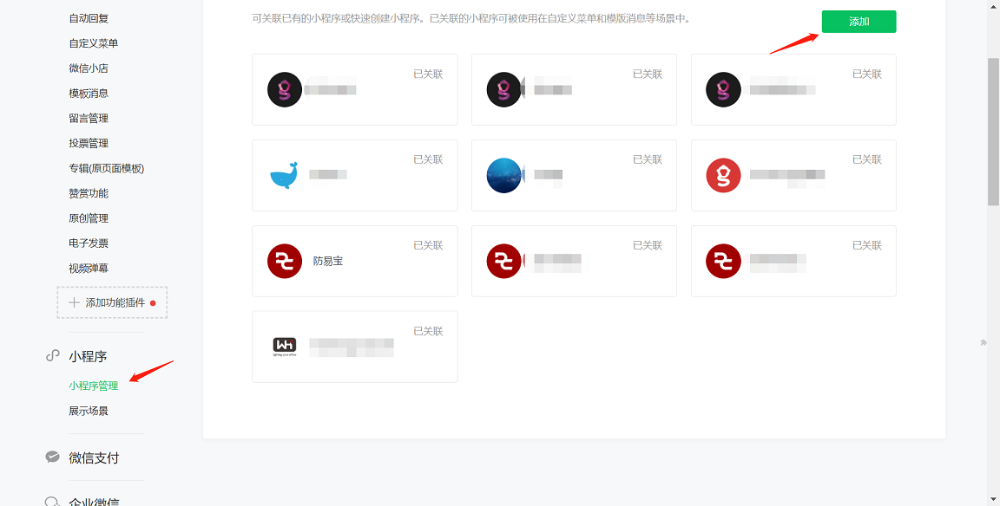

**第二步**

选择快速注册并认证小程序

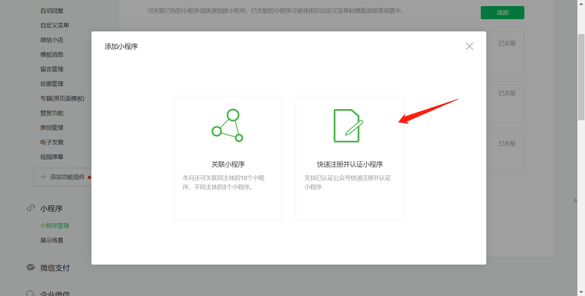

**第三步**

勾选确认“我已明白...“点击快速创建

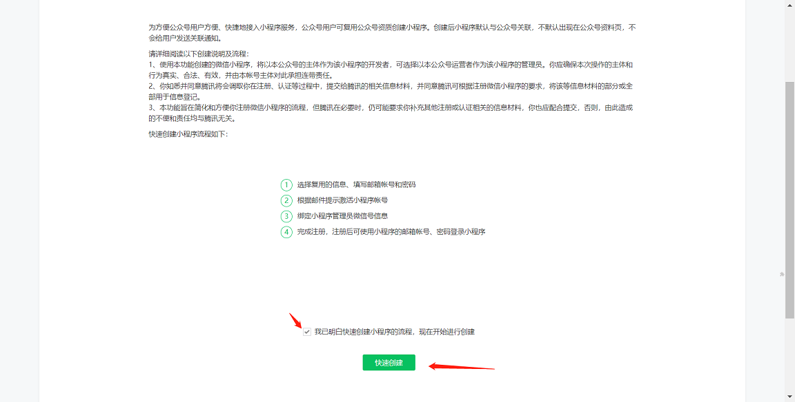

**第四步**

使用管理员微信扫描二维码确认

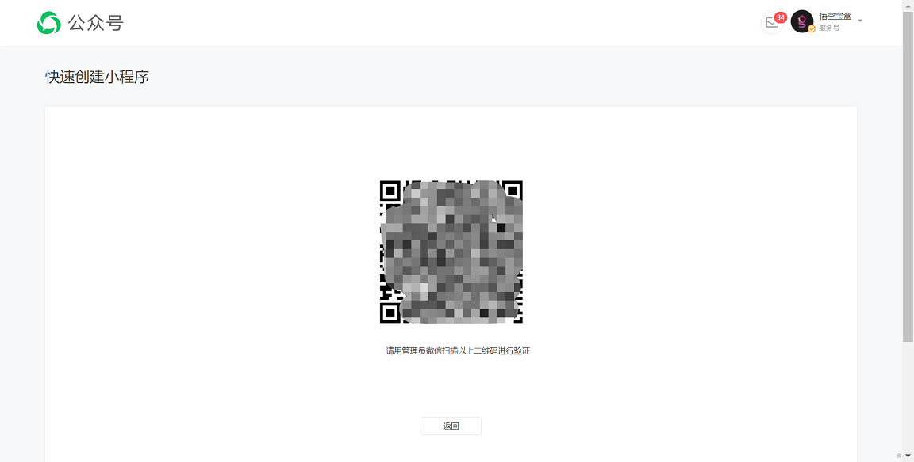

**第五步**

建议复用服务号认证资质勾选后下一步

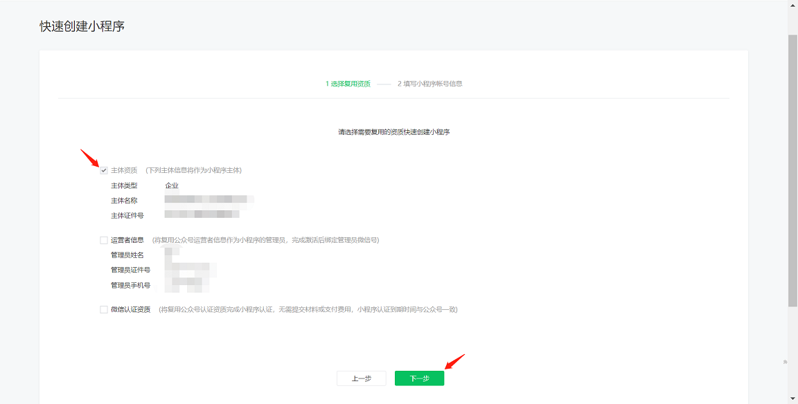

**第六步**

填写一个新的邮箱作为小程序登录账户，该邮箱必须没有在公众平台注册过，填写相关信息点击提交

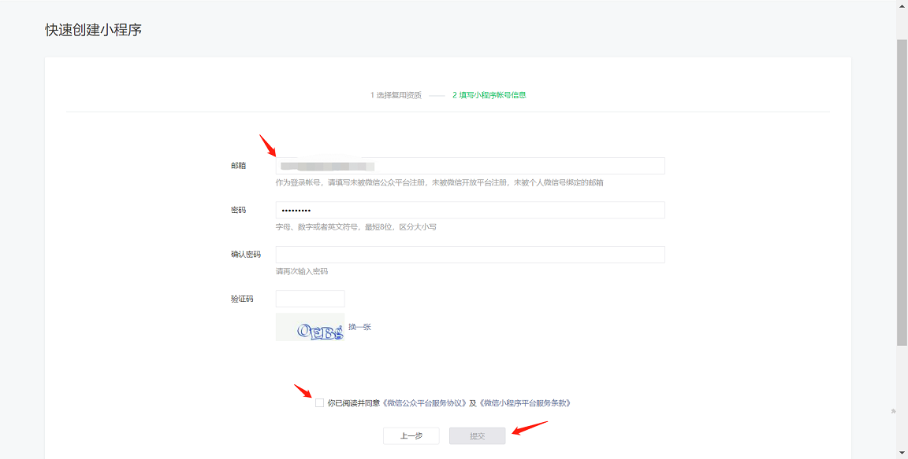

**第七步**

点击前往邮箱进行邮箱链接确认

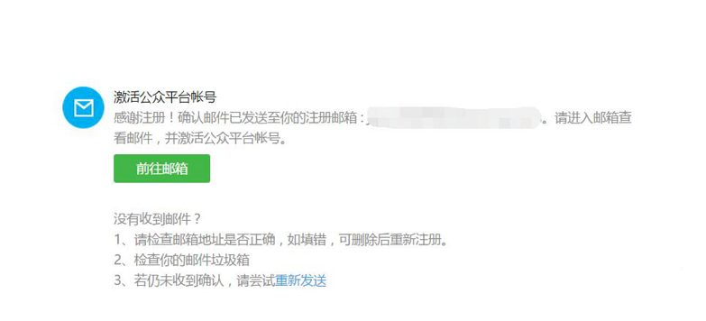

**第八步**

进入小程序后台绑定小程序管理员信息，管理员用本人微信扫码确认

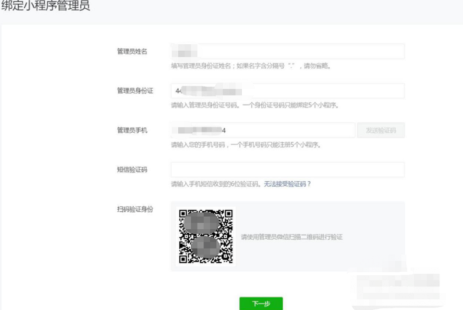

**第九步**

返回微信公众平台，登录刚才注册使用的邮箱账号，点击登录，管理员验证，在设置中补充小程序基本信息

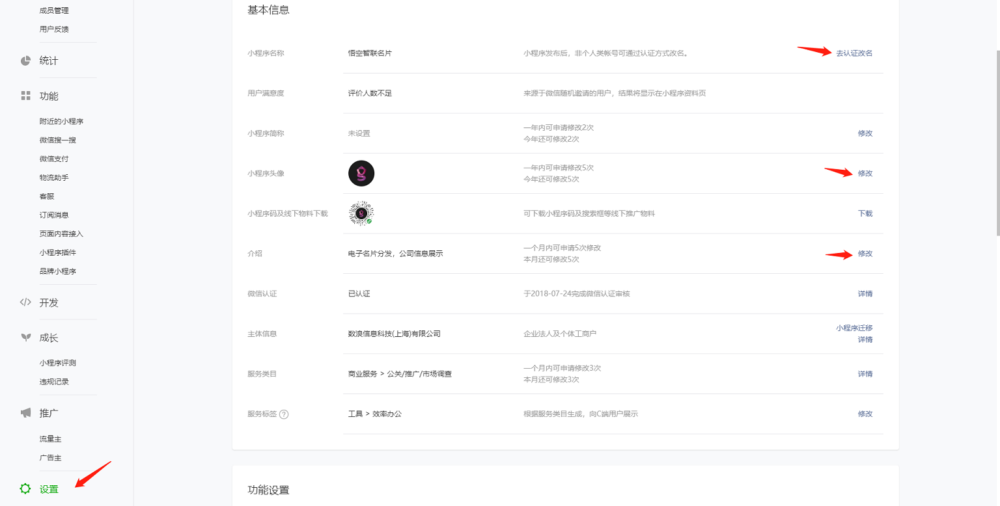

**开发者账号设置**

登陆步骤：注册成功的小程序账号->用户身份->成员管理（添加成员）登陆，开发管理>开发设置>小程序插件

**支付环境申请**

需提供申请认证的相关资料

登陆步骤：登录注册成功的小程序账号->微信支付->开通

**填写详细资料**

完成上述步骤后将以下信息提供给悟空宝盒小程序登陆用账号和密码

品牌logo：png格式，用于小程序主页显示

品牌介绍：用于小程序主页显示

 支付商户号：登陆[**商户平台**](https://pay.weixin.qq.com)->账户中心->商户信息->微信支付商户号

支付商户API密钥：登陆商户平台->账户中心->API安全->设置API密钥

### **3.云打印准备工作**

**建议使用云服务器，若您想要本地部署节点服务器我们给您如下使用节点服务器情况时的软硬件及环境参数参考**

`说明：`配置云打印之前需要您提供一台**节点服务器**（建议该服务器仅作为打印机专用服务器，不做他用）

**硬件参考**

>  内存通道的X86架构的服务器，或更高配置

>     CPU：Intel XeonE3/ E5系列、2.5G主频以上、4核CPU，或更高配置CPU

>     内存：最少8内存或更高配置内存 

>     硬盘: SAS 15K rpm, 500G，或更高配置硬盘

**软件参考**

>     推荐Windows Server 2012 R2或更高版本
> 必须是64位操作系统
> 一个内网固定IP
> 

>  稳定可用的OFFICE软件，包含Word、Excel、PowerPoint等 

**网络环境参考**

>   100M以上以太网，可以访问外网和打印机

**其他外设**   

> 显示器、键盘、鼠标、网线
------
## **二、公司视图配置**

**1. 公司视图与项目视图**

确认完成上述准备工作后，您即可登录悟空宝盒系统。系统界面分为两种视图，即公司视图和项目视图，适用于多种情况，如集团管理与项目管理、总公司与分公司管理等，根据不同身份权限可在不同视图下进行各类操作。

**2. 公司视图**

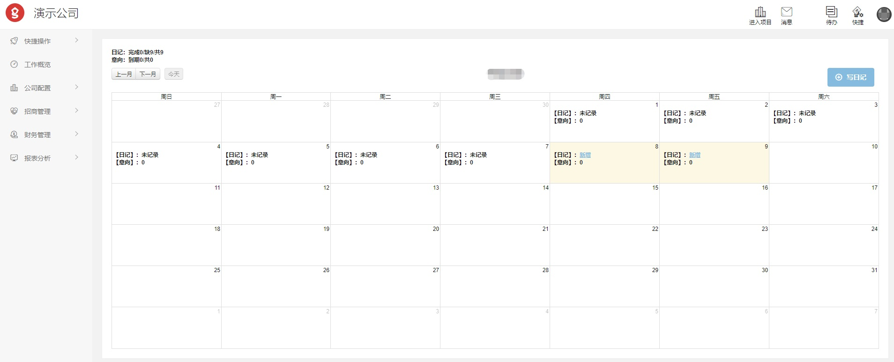

**3. 公司视图各模块及配置顺序**

您需要按顺序完成 **公司视图** 内的各项配置，以便能够顺畅进入 **项目视图**，完成后续的配置，从而完成整个系统的配置。 

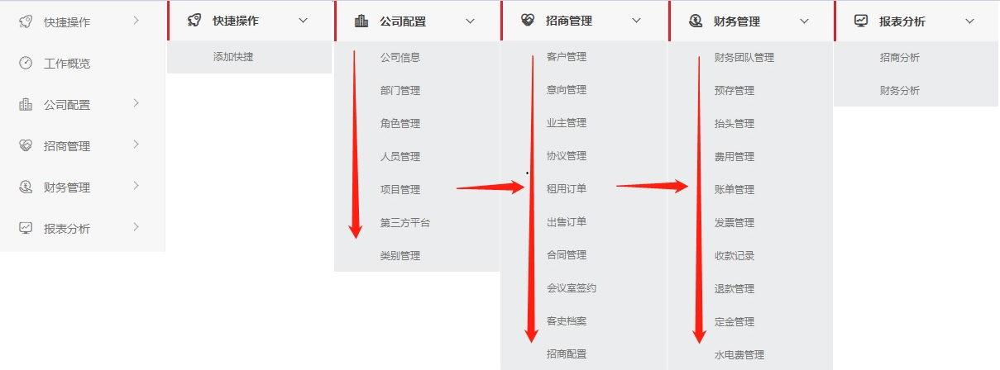

>系统每个功能模块，基本上分为<b>列表、</b> <b>详情、</b> <b>新增、</b> <b>编辑</b> 四个功能页面

>点击  **`新增`**  按钮，打开<b>新增</b>  页面，可以新增加记录

>点击列表中的某一条记录，打开  <b>详情</b> 页面，可以查看记录的详细信息

>点击  **`编辑`**  按钮，打开<b>编辑</b> 页面，可以修改该条记录的信息

**4. 主要功能模块释义**

**4.1 公司配置**

**公司信息**

系统中对公司基本信息、费用类型及小程序的维护模块，如公司负责人姓名、电话维护，费用类别自定义操作，小程序配置 

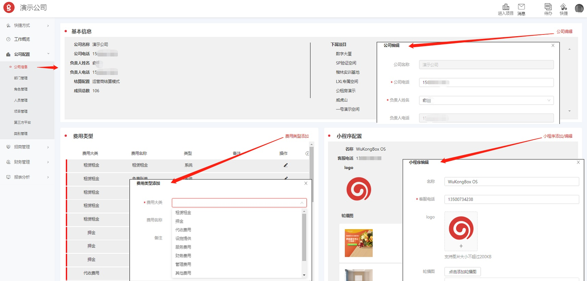

**部门信息**

系统中对公司各部门及部门间从属关系的维护 

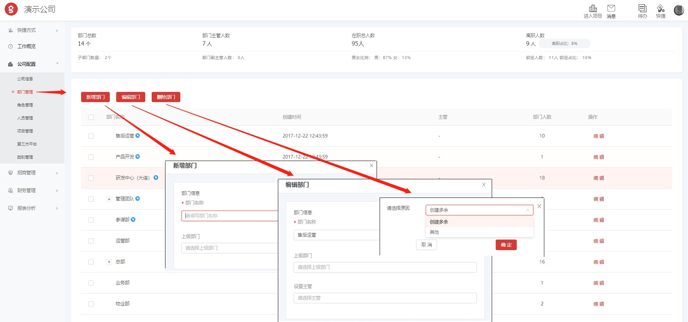

**角色管理**

系统中对人员权限集合的定义，可理解为系统功能权限的集合 

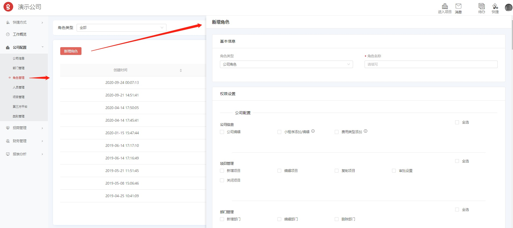

**人员管理**

系统中对公司各部门人员信息的维护，如新增、删除部门员工，员工部门调整，员工状态、权限等 

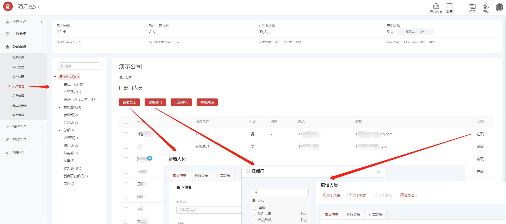

**项目管理**

系统中对公司所运营项目信息的维护，如项目新增编辑、审批设置、租赁规则设置等 

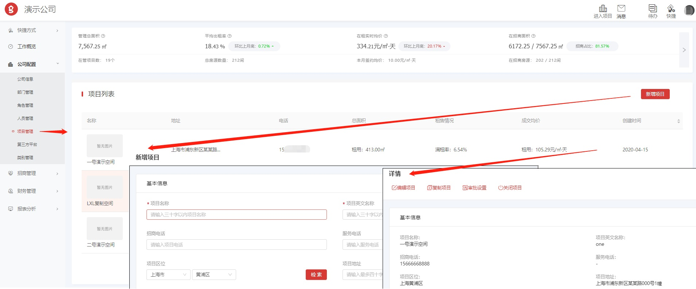

**第三方平台**

系统中对第三方接入平台的维护模块，如钉钉等 

**类别管理**

 即标签管理，可进行标签的新建、删除或其他自定义操作。

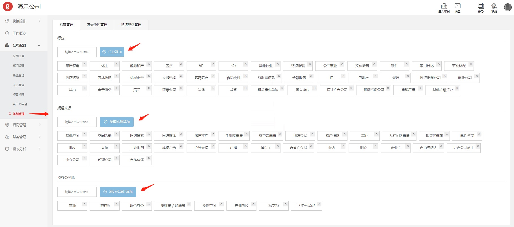

**4.2 招商管理**

**客户管理**

系统中对招商工作所产生的客户信息进行维护管理的模块，如客户属性维护、自定义筛选、变更招商跟进人员等操作 

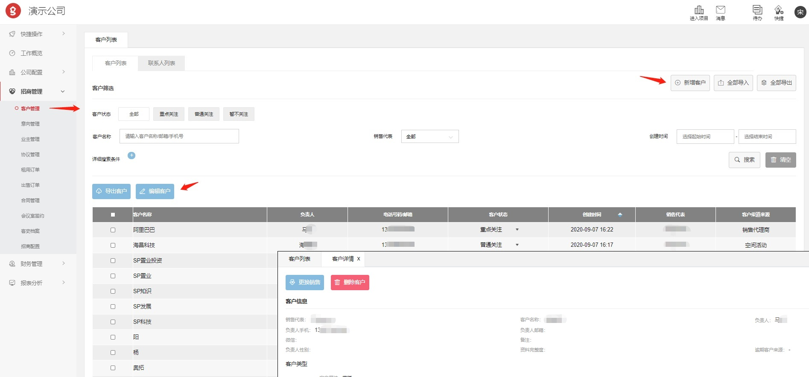

**意向管理**

系统中对招商工作所产生的客户的意向管理模块，如意向跟进、状态查询等 

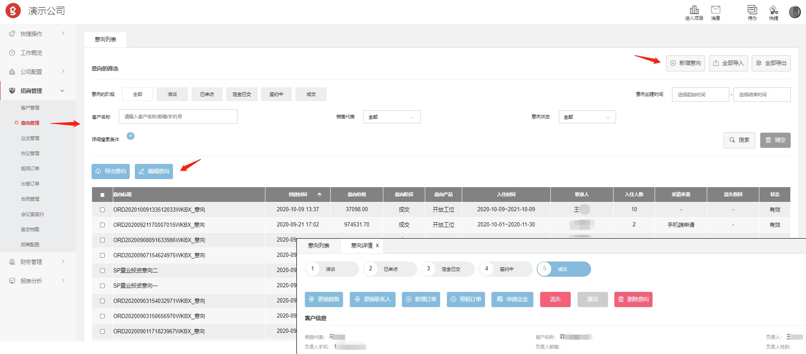

**租用订单（预售订单）与出售订单**

预售订单可以理解为在正式成交前建立的订单，创建预售订单可以锁定房间，在签约后可转变成正式租用订单，租用订单简单来说可以理解为以租赁形式将房源租给入驻客户，您可以按照合同定期向入驻客户收取租金；出售订单可以理解为您将房源一次性售出，并按照合同一次或分期收取费用的形式。

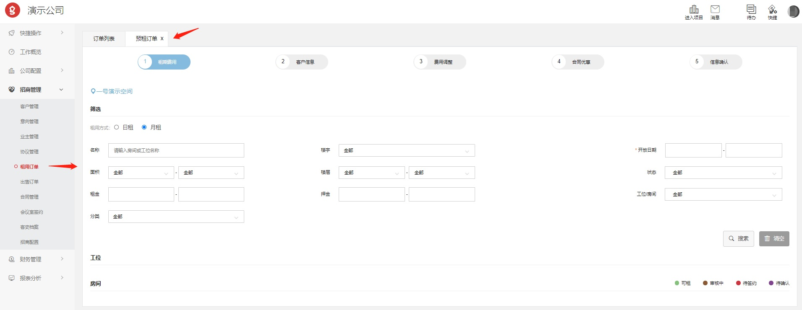

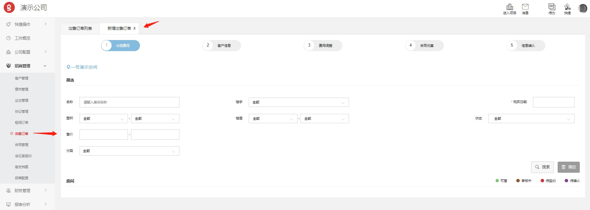

**合同管理**

系统中对合同进行管理和维护的模块，如合同模板维护、按条件筛选合同等 

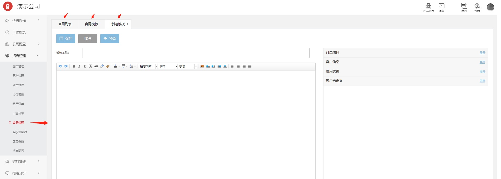

**招商配置**

系统中对公司招商团队、渠道、区域及相应分配规则的维护模块 

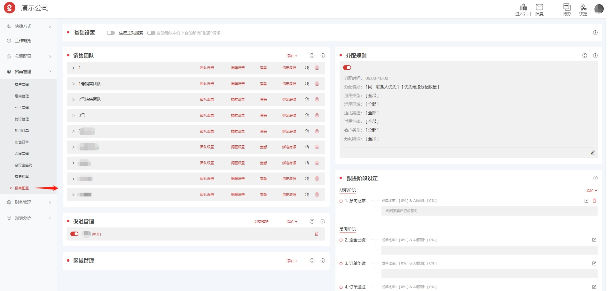

**4.3 财务管理**

**财务团队管理**

系统中对公司财务团队的维护模块，如团队名称、成员及对应的财务团队维护 

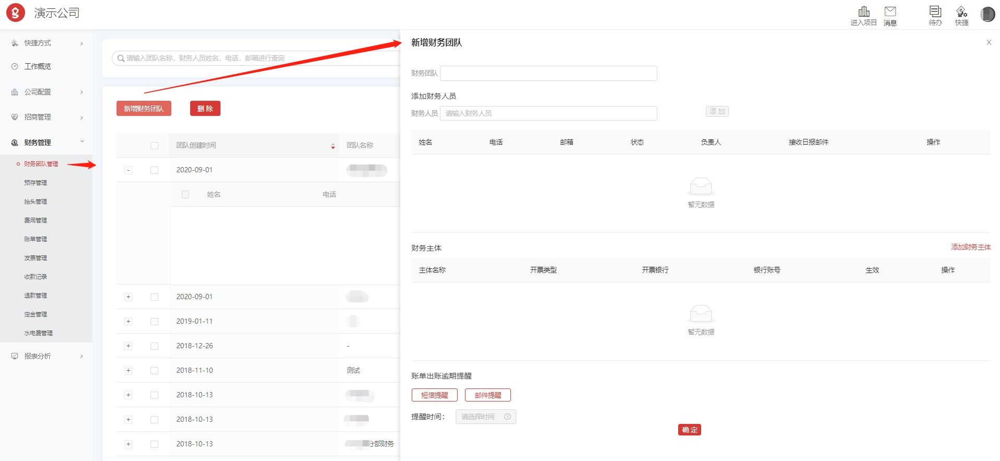

**费用管理与账单管理**

在管理系统中，费用与账单进行分开管理，费用可以是组成账单的子集，一个账单里可以有多笔费用，费用分为自动生成的（租金、押金）和手动添加的。

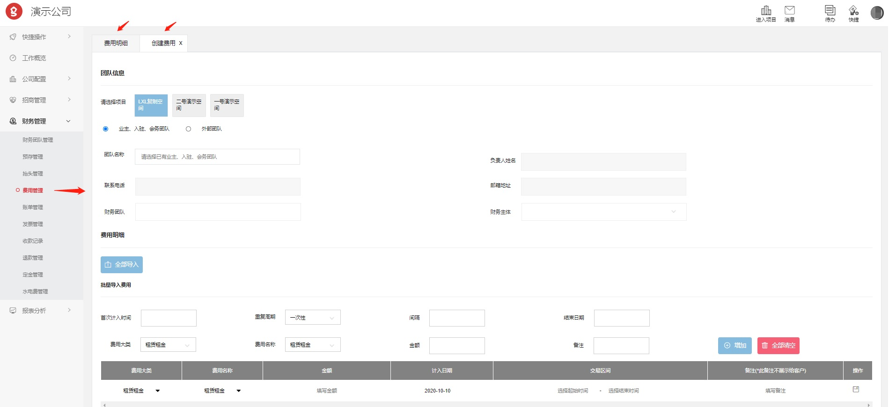

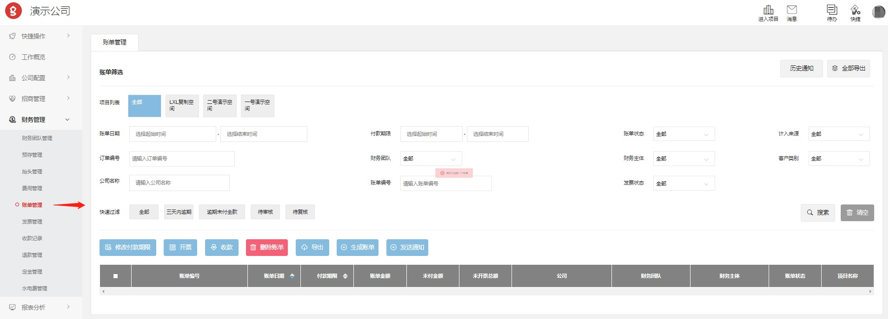

------

#### 公司视图配置举例1：增加新的项目

如果您想增加新的项目，可以在<b>`公司视图`</b>下点击 **`公司配置`** ,然后点击 **`项目管理`** ，打开<b>项目列表</b>页面，点击页面右侧的 **`新增项目`** 按钮，编辑项目的信息  

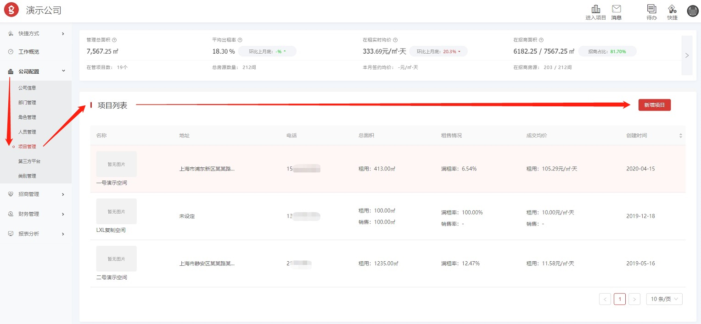

- **基本信息** 
  
  名称等基本信息，按照提示输入即可
  

  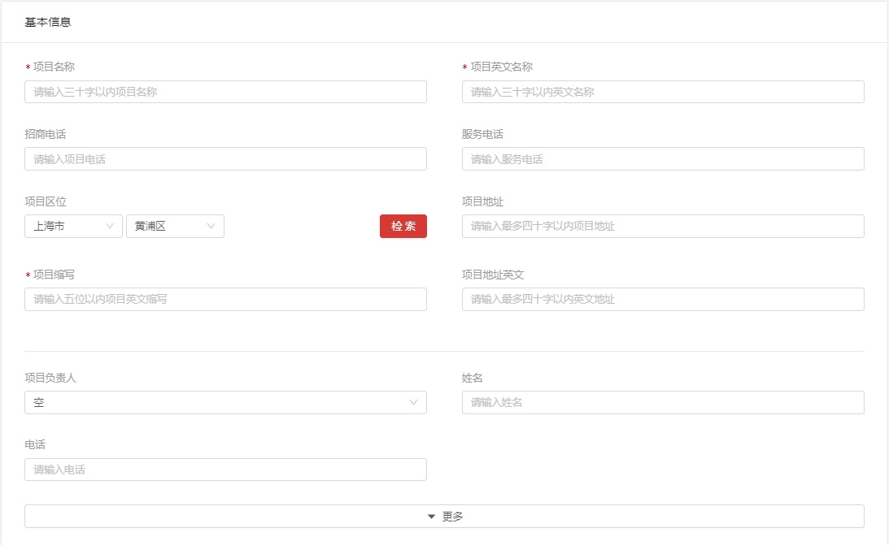
  
- **介绍信息**
  
  可上传图片，也可记录空间的详细文字介绍，此处图片也会在小程序上同时展示
  

  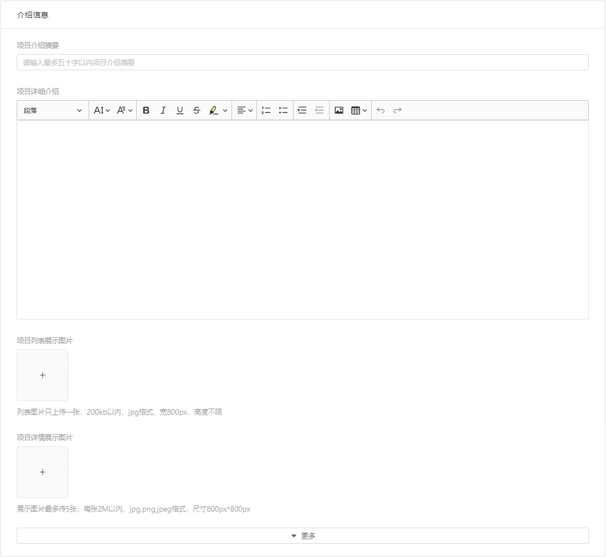

- **租赁规则**
可以设置账期和出账方式，出账方式有四种

    >**1.按固定日期出账** ：按照设置的固定的日期出账单 
  
    >**2.按合同日期出账** ：按照合同的日期，根据设置的提前多少天出账单 
  
  >**3.按照合同开始日期为单月出账(支付周期为2个月)** ： 合同的开始日期如果不是单月的1日，从合同的开始日期开始到第一个双月的月末日期结束为一个账单，以后从单月的1日开始以2个月为周期分割账单
  
  >**4.按照季度出账**：从合同账单开始的日期，到第一个季度月末结束日期为一个账单，以后从单月的1日开始以3个月为周期分割账单
  > 
  

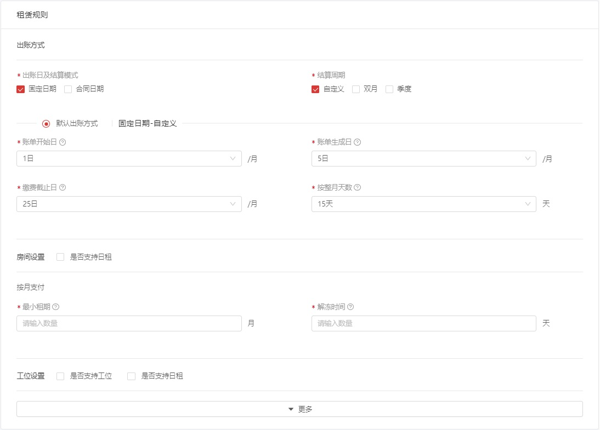

!!! info "有几个概念"

    >**账单开始日**：账单开始的日期 
    
    >**账单生成日**：账单生成的日期即账单的计入日期 
    
    >**缴费截止日**：缴费的截止日期，如果超过截止日期，可能会收取违约金 
    
    >**按整月天数**：超过（包含）此天数即算为整月

!!! tip "注意"

    >如果 **勾选** 支持多种出账方式，在新增订单的时候可以选择出账方式
    
    >如果 **不勾选**，只可以选择默认的出账方式

- **工位设置**

按照提示输入即可，按月支付和按天支付至少需要输入一项。需要注意的事，只有这里设置了按月支付，在新增房间的时候才可以设置月租的租用方式。同理，只有设置了按天支付，在新增房间的时候才可以设置日租的租用方式。详见<b>新增房间/工位</b> 
结算期限：退租，完租后多少天之后才可以进行订单结算。

- **房间设置**

    同<b>工位设置</b>

- **结算方式**

设置以公司为单位结算还是以空间为单位结算

- **违约金比例**

逾期（超过缴费截止日未缴费）的账单将按账单金额的百分比计算每天的违约金额

- **楼宇配置**
  
  设置空间所在（所有）的楼宇名称及位置信息
  

  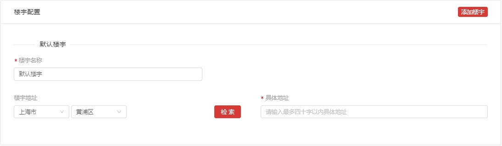

***

#### **公司视图配置举例2：设置审批流程**

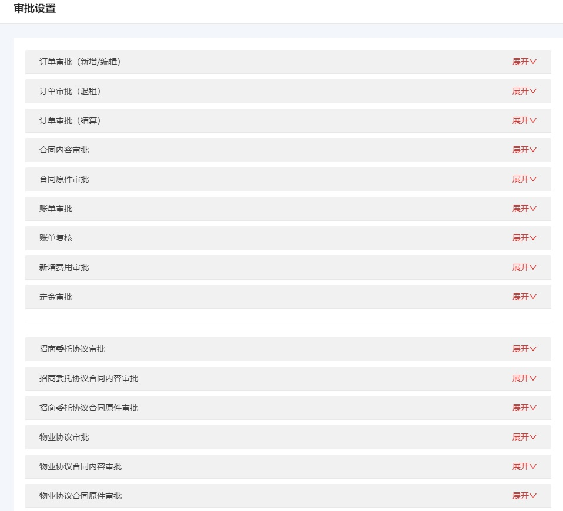

**审批流设置**

`说明`：审批权限设置为——设置具有相关权限职能的多级审批角色，即<b>具有该角色的员工</b>为审批人 

* **订单新增/修改**： 新提交的订单，以及订单生效后进行修改之后所使用的审批流。主要审核客户的资质，房间，价格，付款计划，合同，以及优惠等信息 
* **订单退租**： 发起退租申请的时候使用的审批。主要审核要返还的押金等事项
* **订单结算**： 客户最后清算时使用的审批。主要审核已发生的费用和实际退的金额 
* **合同内容**： 原则上，由合同模板直接生成的合同为有效合同。当合同内容进行修改的时候， 使用的审批流。 主要审核合同的文本内容
* **合同原件**： 审核合同最后的签署件使用的审批流。主要审核合同内容，以及印章等
* **新增费用**： 手工录入费用的时候使用的审批流。主要审核费用金额，公司或房间名称 
* **新建账单**： 手工创建账单的时候使用的审批流。主要审核账单包含的费用，付款周期等
* **账单复核**： 手工创建账单提交复核申请的时候进行的操作。主要审核需要复核的账单
* **定金申请（暂未开启）**： 客户交付定金使用的审批流。主要审核要锁定的房间，定金金额，拟合同金额等

**支持的审批类型**

* **无审批**： 不设置审批，流程中会自动进入下一步
* **悟空宝盒**： 审批消息和动作确认在悟空宝盒系统内完成
* **阿里钉钉**： 审批消息和动作确认会发送到阿里钉钉中完成。（只有在“第三方平台”中配置了“阿里钉钉“之后，才有此选项）

#### **公司视图配置举例3：新增订单**

新增订单之前我们需要在合同管理中先创建一份合同模板，将需要填写的信息留出来用替换字符替换，或者创建自定义字符替换。

完成上述操作后，我们可以进入 **`招商管理`**功能模块  ，点击**`租用订单`**，再点击 **`新增订单`**.

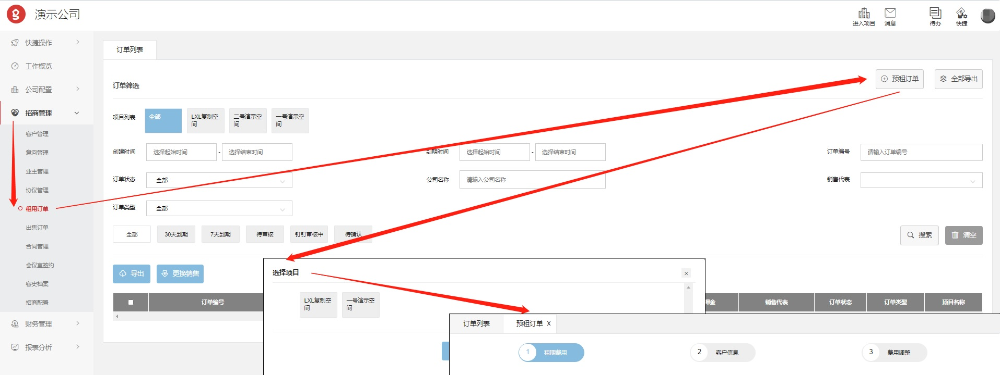

**租期费用**

- **筛选**
  
  点击菜单按钮 **`招商管理`** ,然后点击 **`订单管理`** ，打开**订单列表**页面，设置筛选条件，点击 **`搜索`** 按钮，满足条件的可租用的工位/房间会显示在**工位**和**房间** 区域
  

- **房间/工位**
  
  选取想要租用的房间/工位，点击名称后的购物车图标，选取的房间/工位会放到页面下方的购物车中
  

- **购物车**
  
  输入支付周期，如果有优惠，可以输入免费的开始日期和结束日期，选择出账方式，如果是工位的话，需要输入工位的数量（团队成员人数不能超过工位的数量。详见 **团队管理**），点击 **`下一步`**
  

  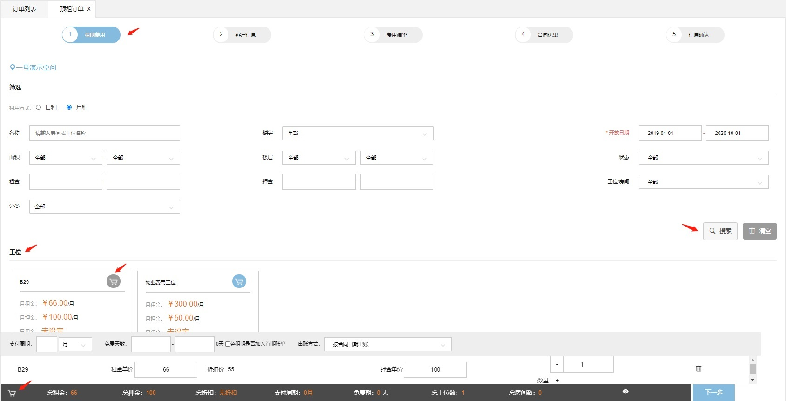

**客户信息**

选择销售人员，销售渠道，输入客户信息（如果是既有的客户，可通过关键字搜索），点击 **`下一步`**

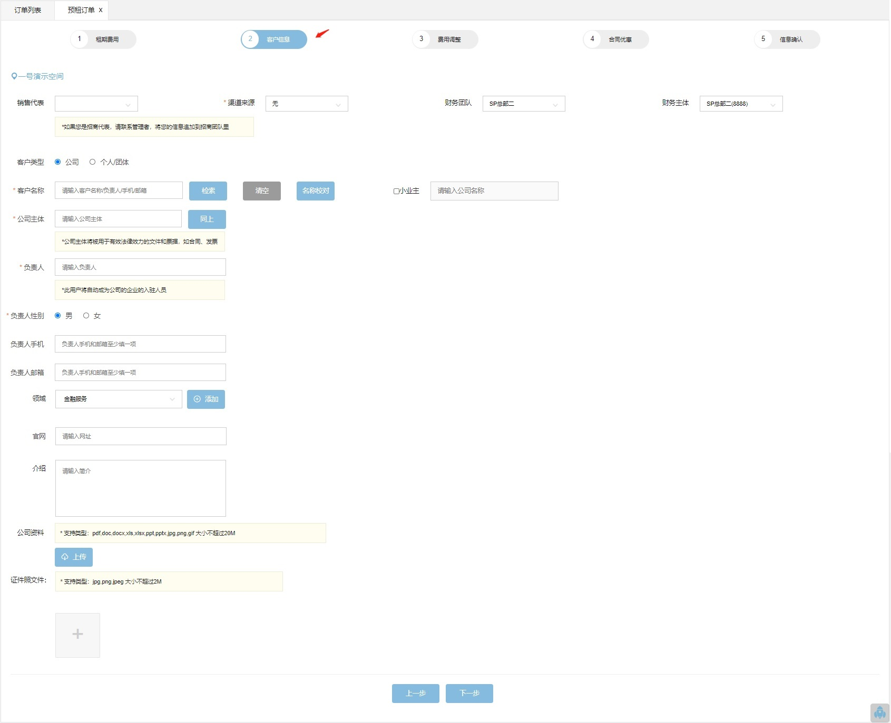

**费用调整**

- **租用明细**
  
  再次确认下显示的租用信息是否正确
  

- **费用调整**
  
  可以修改费用金额，计入日期，也可以按照比率修改金额
  

- **其他费用**
  
  详见 **费用管理**
  

**合同优惠**

在设定好之后，可以在预约会议室和打印的时候，设置每月优惠额度。

**信息确认**

再次确认下显示的信息是否正确，如果有问题，点击 **`上一步`** 返回修改，否则点击 **`提交`** ，此时订单为 **“待签约”**状态，如果 **订单列表**页面没有这条订单，特别注意 **订单筛选**里的订单状态是否选择正确。 **“待签约”** 状态的订单需要在 **合同管理**中签约

点击菜单按钮 **`招商管理`** ,然后点击 **`合同管理`** ，打开 **合同列表** 页面，设置筛选条件，点击 **`搜索`** 按钮。点击需要签约的合同编号，打开 **合同详情**
页面，点击 **`上传原件`** 按钮，上传合同原件，点击 **`提交`** 后，订单状态变为 **“待确认”**

打开 **订单列表**页面，搜索  **“待确认”** 的订单，没有这条订单，特别注意 **订单筛选** 里的订单状态是否选择正确。点击该条订单记录，打开 **订单详情**页面，点击 **`确认订单`** 按钮，订单创建成功后订单状态变为  **“已生效”** 。产生的费用和账单可在  **财务管理** 查看，详见  **费用管理** 和  **账单管理**

------

## 三、项目视图配置

**1. 项目视图**

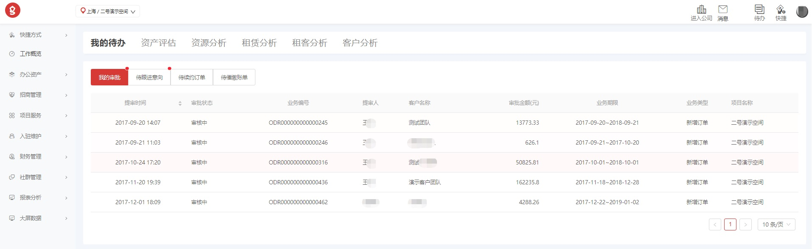

**2. 项目视图各模块**

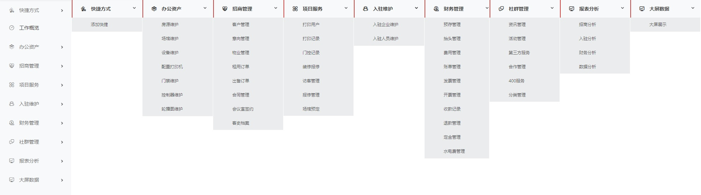

>系统每个功能模块，基本上分为<b>列表、</b> <b>详情、</b> <b>新增、</b> <b>编辑</b> 四个功能页面

>点击  **`新增`**  按钮，打开<b>新增</b>  页面，可以新增加记录

>点击列表中的某一条记录，打开  <b>详情</b> 页面，可以查看记录的详细信息

>点击  **`编辑`**  按钮，打开<b>编辑</b> 页面，可以修改该条记录的信息

**3. 主要功能模块释义**

**3.1 办公资产**

**房源（房间/工位）维护**

 系统中对房间、工位的信息维护管理模块，只有还没被租用的工位、房间才可以在<b>招商管理</b>里出租 

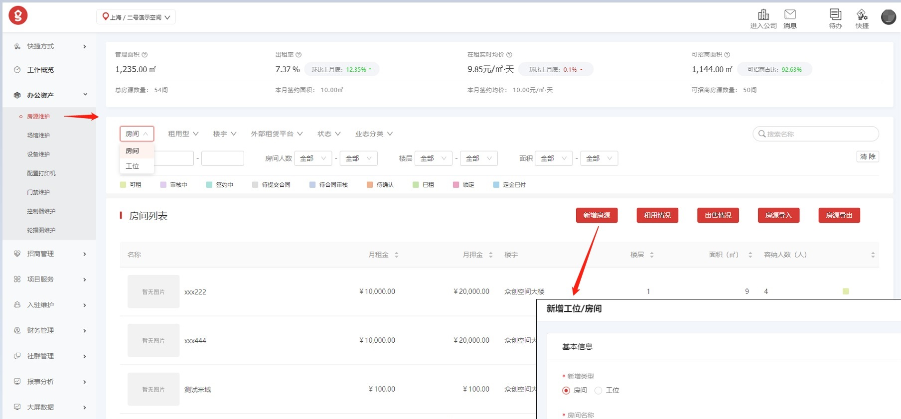

**场馆维护**

 系统中对会议室等设施的信息维护管理模块，维护完成的场馆在<b>项目服务</b>里预定租用 

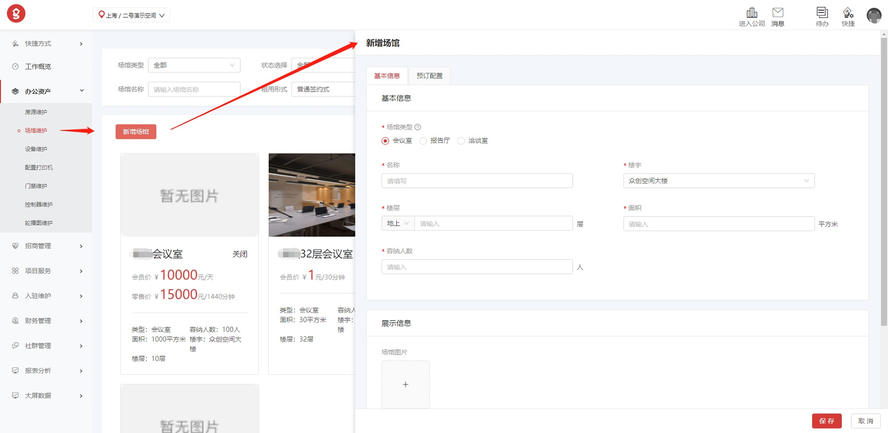

**设备维护**

系统中对设备信息，比如说投影仪等设备的信息维护管理模块，维护完成的设备在<b>项目服务</b>里预定租用 

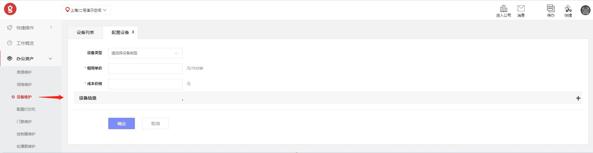

**配置打印机**

系统中对打印机信息，包括团队每月优惠与设备基础配置信息，在<b>小程序</b>或者<b>电脑驱动打印</b>可以进行打印操作 

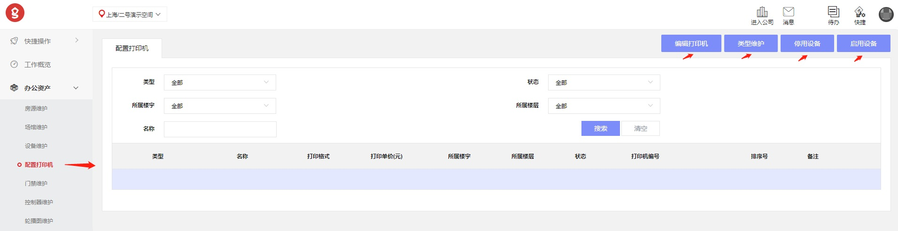

**门禁维护**

系统中对门禁信息，包括蓝牙、二维码、SN号等的维护管理，在<b>小程序</b>中可以进行门禁的开门操作 

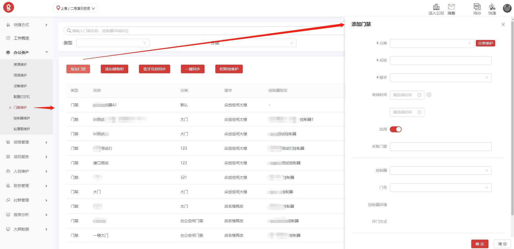

**3.2 招商管理**

 可参考公司视图下各项配置 

**3.3 项目服务**

 主要为系统中对各项服务的记录，包括打印、门控、场馆等。在系统投入使用后，报修和访客的管理按照提示配置即可 

**3.4 入驻维护**

**团队维护**

在订单生成之后，输入的团队信息可以在  **团队维护** 里编辑。批量添加会员也在此处操作。

**会员管理**

在订单生成之后，团队负责人会自动登录成会员。团队的其他成员需要在  **会员管理** 里维护

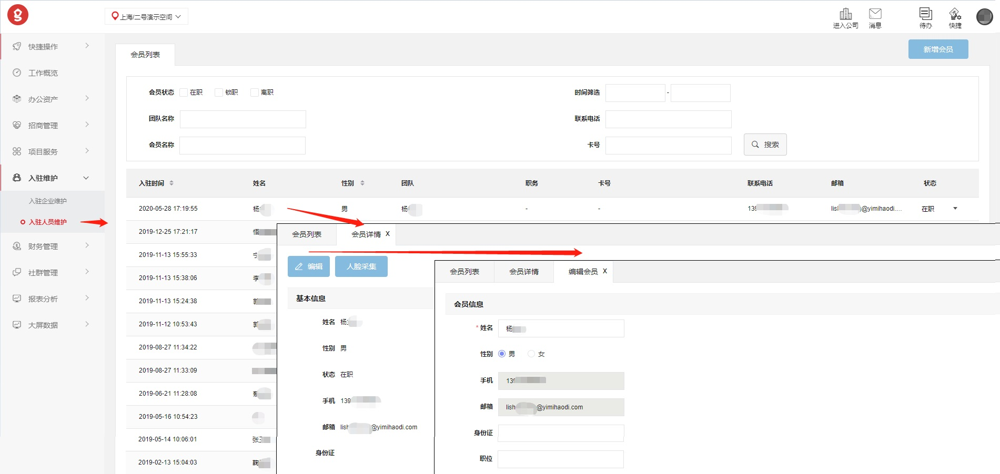

**3.5 财务管理**

 可参考公司视图下各项配置 

**3.6 社群管理**

**资讯管理**

点击 **`社群管理`**，选择资讯管理，添加一篇新的文章，将资讯的主要信息填写进入相对应位置，点击发布

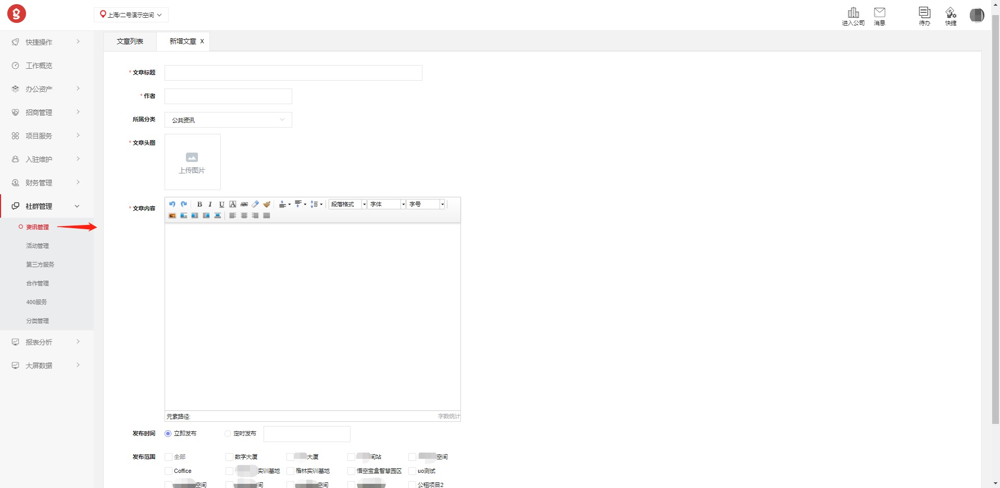

**活动管理**

点击 **`社群管理`**，选择活动管理，添加一条新的资讯，将资讯的主要信息填写进入相对应位置，点击发布；注意，在资讯和活动的富文本编辑器中添加图片文件时，需要将文件保存在本地，通过编辑器中的添加按钮进行添加。

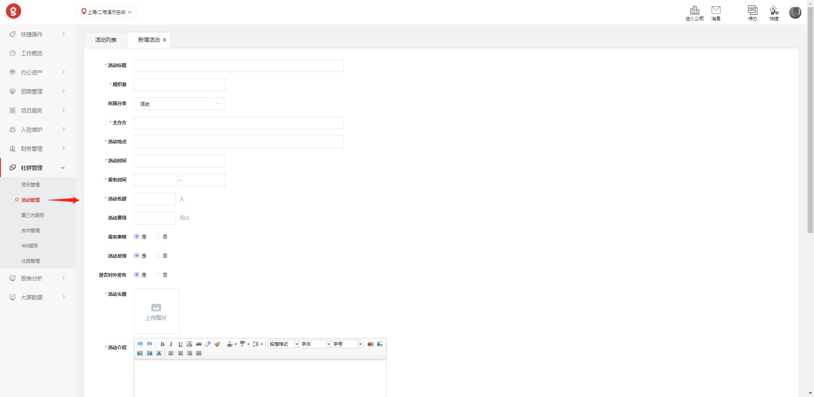

**第三方服务**

在 **`社群管理`**中，点击 **`第三方服务`**,添加新的服务，填写对应的信息。

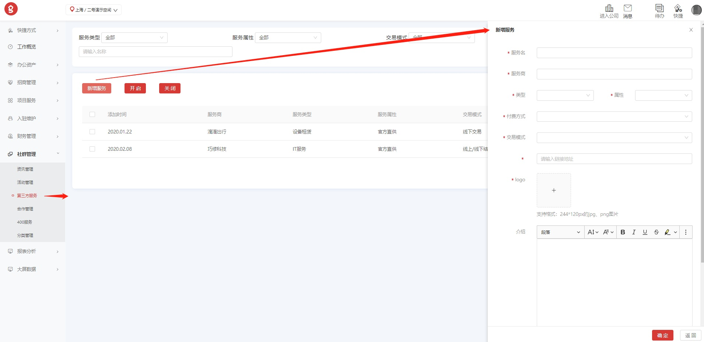

------

#### **项目视图配置举例1：为项目增加工位/房间** 

可以点击菜单按钮 **`办公资产`** ,然后点击 **`工位/房间维护`** ，打开<b>工位/房间列表</b>页面，然后点击 **`新增工位/房间`** 按钮，打开<b>新增工位/房间</b>页面

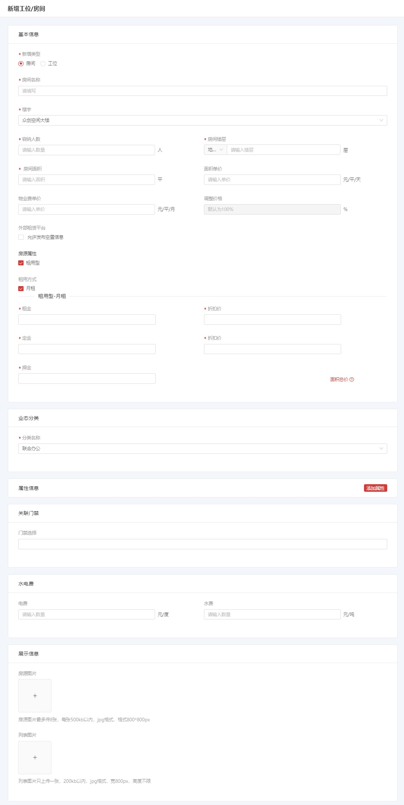

- **基本信息**
   
  <b>工位/房间</b>的基本信息，租用方式日租/月租是否可选，取决<b>空间管理</b>的<b>工位/房间</b>设置
  

- **业态分类**
  
  选择主营业态的分类
  

- **添加属性**
  
  添加工位/房间的有特色的属性，点击 **`+`** 可添加多条
  

- **关联门禁**
  
  在<b>门禁维护</b>设置好门禁类型后，可在此处配置当前<b>工位/房间</b>所具有的门禁权限
  

- **展示信息**
   
  可上传工位/房间的照片
  

***

#### **项目视图配置举例2：设置既有的房间/工位**

**编辑**

在**房间/工位列表**页面，点击需要修改的房间/工位，打开**房间/工位详情**页面，然后点击 **`编辑`** 按钮，打开**编辑房间/工位**页面。编辑内容详见**新增房间/工位**

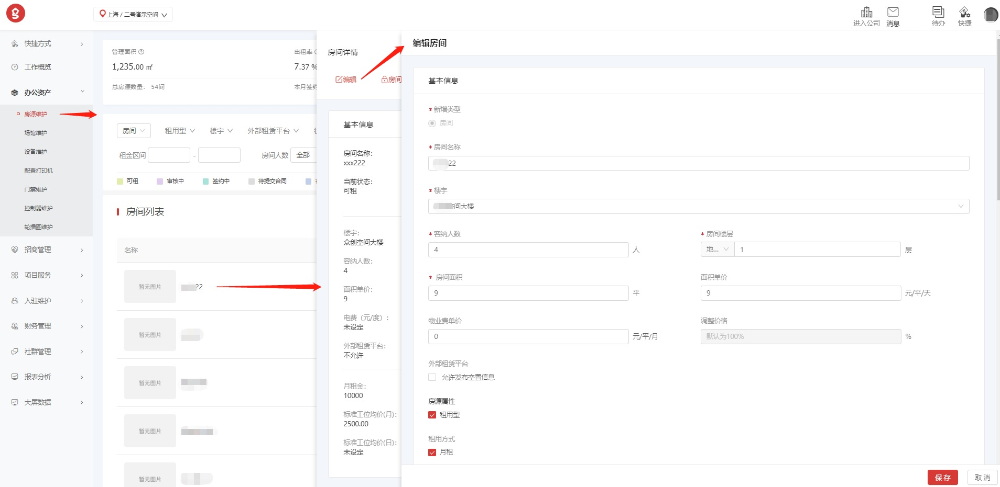

**锁定**

在**房间/工位详情**页面，点击 **`锁定`** 按钮，在打开的页面中输入需要锁定的工位数量，然后点击 **`确定`** 按钮，被锁定的房间不能进行新增订单操作。

**解锁**

点击 **`解锁`** 按钮，在打开的页面中输入需要解锁的工位数量，然后点击 **`确定`** 按钮

**租用情况**

点击 **`租用情况`** 按钮可方便查询空间（项目）上目前的房屋租用情况，系统会根据不同颜色区分房间状态

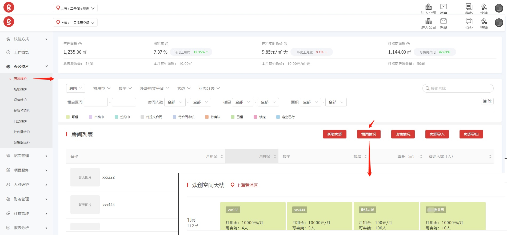

#### **项目视图配置举例3：门禁维护**

***

**控制器**

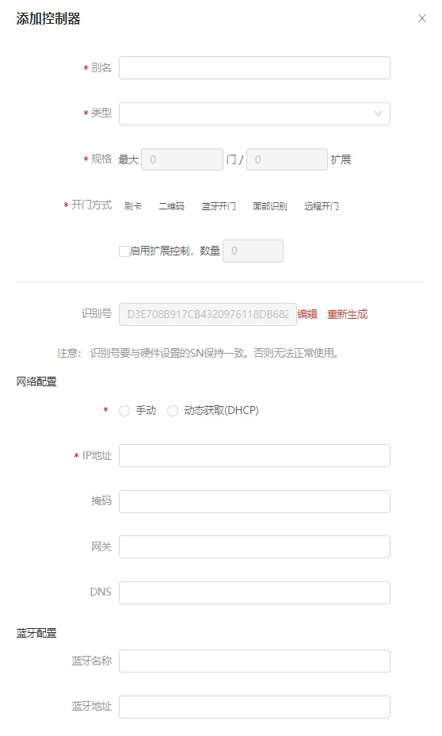

- **别名**： 系统显示名称，用于添加门禁时需要根据别名选择控制器
- **类型**：控制器硬件类型，目前主要有【悟空宝盒-mini】和【悟空宝盒-standard】两种型号
- **规格**：单个控制器硬件可控制门数和可扩展端口数，扩展端口一般用于储物柜
- **开门方式**：根据不同控制器，选择不同开门方式
- **识别号**：控制器设备的唯一识别号
- **网络配置**: 控制器网络配置，选DHCP时IP地址等信息可不填写
- **IP地址**：控制器ip地址
- **蓝牙名称**：选择蓝牙开门的时候填写，蓝牙设备的pid_lockid_areaid_gateid
- **蓝牙地址**：蓝牙设备的mac地址

**门禁配置**

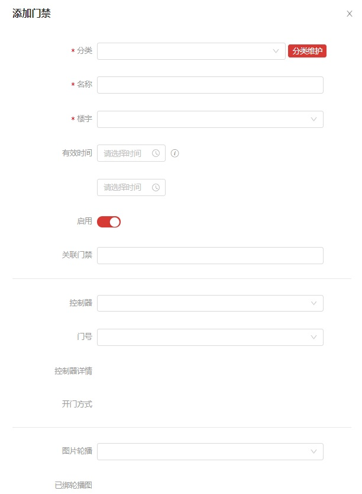

- **门禁分类**：可以添加，编辑。用于门禁分组。举个例子，可以根据楼层来划分分类，或者根据功能（梯控，轧机）划分。  
- **门禁名称**：系统显示门禁名，通常和房间号对应。
- **楼宇**：选择要配置哪个楼宇的门禁，选取后在依赖门禁列表中会显示当前楼宇的门禁。
- **有效时间**：如果设置了有效时间，此门只有在此时间段内才能被打开
- **启用**：打开状态该门禁可用
- **关联门禁配置**：配置现在的门禁，同时会拥有依赖门禁的权限。以大门和开发室为例，想去开发室必须经过大门，所以通常设置开发室门的时候将大门作为依赖门襟。这样为用户赋予门禁权限的时候，只选开发室即可同时拥有开发室和大门权限。
- **控制器**：当前门禁绑定的控制器，根据实际接线选择已添加控制器
- **门号**：当前门禁绑定控制器的门号，根据实际接线选择
- **开门方式**：选择需要的开门方式
- **轮播图片**：pad门禁控制设备显示的轮播图片。

**权限组维护**

权限组是门禁权限的集合。可用于给入驻企业成员或者访客赋予门禁的权限。在  **权限组维护**页面，填写下面的内容

- **权限组名称**：可以添加，编辑。
- **启用**：打开状态该权限组可用
- **门禁**：选取权限组所具有的门禁权限。

------

## 四、常见问题Q&A

### WEB系统

**Q：** 为什么我在登录不进去系统了？

**A：** web管理端在使用时需要保证良好的网络环境，在登录不上时可以查看当前网络状态是否通畅，或可以更换浏览器【建议使用Chrome浏览器】重新登陆；检查您输入的URL是否正确；检查您输入的账号密码是否正确。

**Q：** 为什么有些按钮和功能我看不到？

**A：** 尝试刷新浏览器，若仍然无法显示联系管理员，查看是否未配置相关权限。

**Q：** 为什么我在创建订单的时候看不到房源信息？

**A：** 可以先查看房源管理中是否已录入房源信息，该房源状态是否未可租状态；若房源配置没有问题，请确认在创建订单操作时是否操作错误，比如输入租期后未点击搜索按钮。

**Q：** 我创建完订单为什么看不到？

**A：** 生成订单后您需要在合同管理中提交合同原件，并在订单管理中找到待确认状态下的订单点击“确认生效”才可以看到“已生效”的合同

**Q：** 有员工离职了我该怎么操作？

**A：** 管理员在公司模式下，进入`人员管理`找到离职员工，点击`员工离职`。

**Q：** 客户租期已到为什么不能进行结算？

**A：** 在系统中查看一下该租户的押金账单是否进行了确认收款操作，在确认收款后才可以进行退租预结算

### 小程序

**Q：** 为什么我的小程序获取不到二维码？

**A：** 检查一下小程序登录状态，可以退出微信关掉微信进程重新登陆。

**Q：** 为什么我可以上传文件，但是不能打印？

**A：** 联系管理员，查看打印额度是否已用完。

**Q：** 我在小程序上预约了会议室，为什么不能开门？

**A：** 首先查看下会议室订单状态是否预约成功，如果预约成功需要在预约时间之后才可以进入会议室，提前无法进入。

**Q：** 为什么我“联系客服”打字了但是没有回应？

**A：** 联系管理员是否在小程序公众平台开通了客服功能并且设置了客服人员微信。

**Q：** 为什么我在线支付会议室（打印）小程序显示“参数未配置”？

**A：** 联系管理员小程序公众平台是否已开通在线支付功能并且已关联商户号。

### 硬件

**Q：** 为什么我扫码/刷卡之后无法开门？

**A：** 联系管理员检查门禁控制器是否供电供网正常，再检查一下人员权限是否配置正确，可以联系宝盒技术支持进行排查。

**Q：** 打开门后插锁一直在响无法成功关门怎么回事？

**A：** 由于正常使用或者型材偏移导致插锁无法正好落入孔洞中，可以联系管理员或者宝盒硬件支持进行调整。

**Q：** 为什么我的手机蓝牙开门失败了？

**A：** 蓝牙开门失败可以检查一下以下几个地方：

  	·手机蓝牙是否打开

​	·手机定位是否打开

​	·手机的微信获取定位权限是否打开

  	确认好以上几点关掉微信进程重新登陆尝试重新开门。

**Q：** 为什么我传好了文件但是打印机不出纸？

**A：** 检查打印机的供电供网状态，确认无误后检查是否有卡纸或者耗材耗尽，可以联系宝盒技术支持远程排查。

