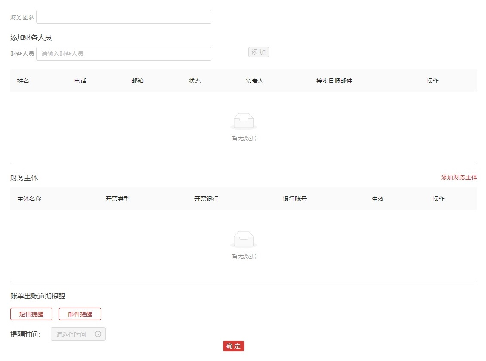
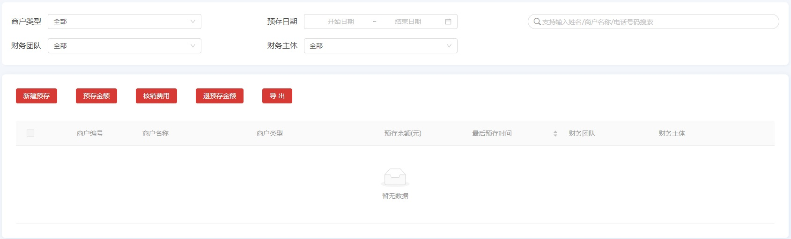
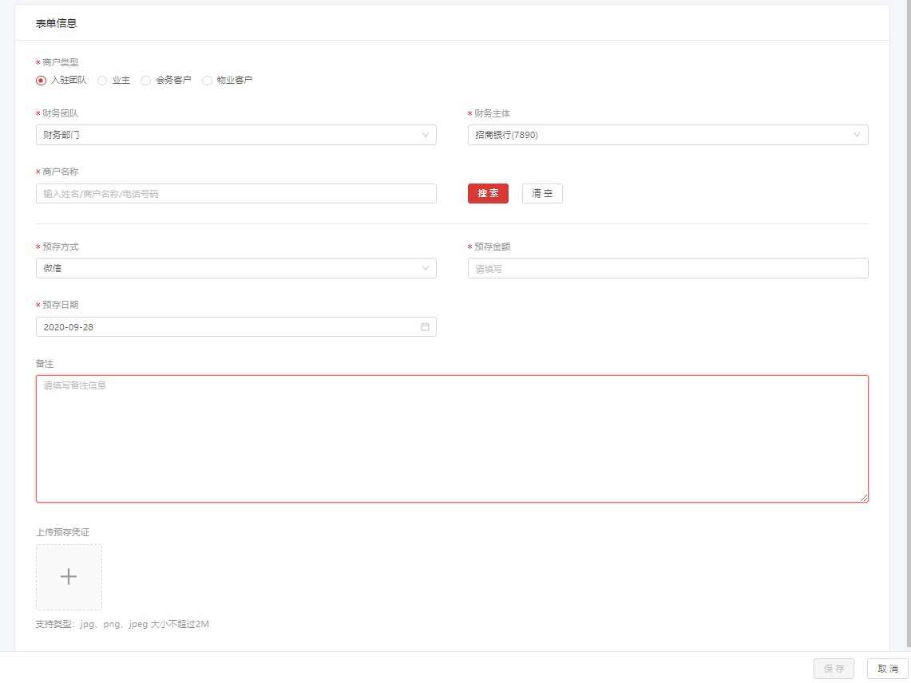
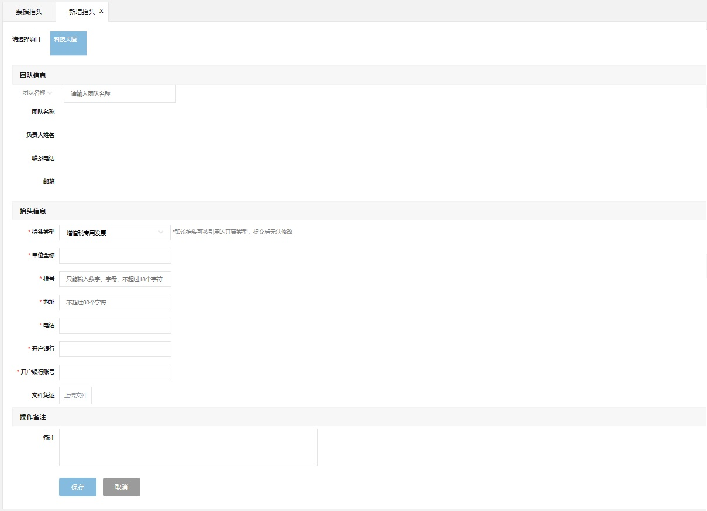
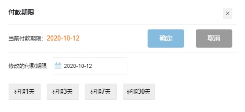

# 财务管理
!!! note ""
    本章介绍了财务管理的各个模块的功能

###财务团队管理
***

####新增财务团队
点击 **`新增财务团队`** 按钮，可以新增 **财务团队**、编辑财务人员并设置财务团队所管理的 **财务主体**。订单与 **财务主体** 关联，能实现不同的订单交到不同 **财务主体**，包括租金物业费交到不同账户。

对于逾期账单，客户已设置通过短信还是邮件通知财务团队成员。

####编辑财务团队
选取 财务团队记录后的 **`详情`** 按钮，可以编辑现有的 **财务团队** 的设置。

***

###预存管理

***

####新建预存
点击 **`新建预存`** 按钮，可以预存金额到商户所对应的财务主体账户中。在发生费用时抵扣。

####预存金额、退预存金额
可以通过 **`预存金额`** 、**`退预存金额`** 追加储值和退预存款

***

### **抬头管理**

***

####新增发票抬头
- 团队信息
需要设置条件，搜索团队的信息，验证需要新增发票抬头的团队是否是已入驻的团队，
可点击 团队信息 下方`ˇ`按钮切换搜索条件 

- 抬头信息
先选取 **抬头类型**，其他需要输入的信息会根据抬头类型而不同，
同时要上传 **文件凭证**，以备下一步审核
 

点击 **`保存`** 按钮后可以新增发票抬头，此时是
**待审核** 状态，点击 **`取消`** 按钮可不保存返回到 **<u>票据抬头</u>** 页面

####启用/停用/编辑
点击需要操作的记录，打开 **<u>抬头详细</u>** 页面

**待审核** 的发票抬头可以审核通过和编辑，点击 **`启用`** 按钮可审核通过后为 **已启用** 状态  
**已启用** 的发票抬头可以停用和编辑，要停用可点击 **`停用`** 按钮后，状态变为 **已停用**   
**待审核** 和 **已启用** 的发票抬头，都可以编辑，点击 **`编辑`** 按钮后为 **待审核** 状态，需要再次审核。
**已停用** 的发票抬头可以编辑和启用。  
可以点击 **`删除`** 按钮，删除当前发票抬头，删除后不可恢复。

***

### **费用明细**

*** 

订单创建时系统生成的费用或水电费等手工创建的费用都在 **<u>费用明细</u>** 里可查看和处理
####费用明细
在 **<u>费用列表</u>** 页面的 费用筛选里设置搜索条件,点击 **`搜索`** 按钮，可现实符合条件的记录

**费用状态：**
  
- 未出帐：根据费用的计入日期，还没有出账的费用  
- 未支付：已出账单还没有支付  
- 已支付：已出账单并支付完成  
- 已删除：已经删除的费用，只有人工创建的账单才能删除  
- 已核销：在退租结算之后，押金抵消费用或退款之后  
- 待审核：等待审批的费用，审批设置在 **<u>公司配置/空间管理</u>** 页面里  
- 钉钉审核中：设置了钉钉审批流程的话，**待审核** 为 **钉钉审核中** 状态  
- 已驳回：审批没有通过，被驳回的费用   

**记入来源**

- 系统：系统生成的费用  
- 人工：通过 **<u>创建费用</u>** 增加的费用

####创建账单
可以将 **未出帐** 的费用 **`创建账单`** 后出账，对于入驻团队，同一团队 **未出帐** 的费用可合并到同一账单下，创建后为 **未支付** 状态。如果不在此处创建账单，可等待系统按照配置自动出账。外部团队不能合并账单。

####加入账单
可以将同一公司，**未出帐** 的费用，合并到同一账单下出账，创建后为 **未支付** 状态。

####驳回/通过
**待审核** 状态的账单，点击 **`驳回`** 按钮可可驳回审核，点击 **`通过`** 可通过审核。

####创建费用
如果需要手工创建费用，点击 **`创建费用`** 按钮，打开 **<u>创建费用</u>** 页面

- 团队信息 
入驻的团队创建费用，点选 **`入驻团队`**，如果是没有入驻的团队，点选 **`外部团队`**
 

- 费用明细 
有两种方式导入费用  
1.**通过模板导入：** 点击 **`全部导入`** 按钮，打开 **<u>全部导入</u>** 子页面，**`上传模板`** 后，点击 **`模板校验`**，校验成功后，点击`提交`按钮。  
2.**通过页面录入：** 输入以下内容   
  - 首次记入时间: 费用的起始时间  
  - 结束时间: 费用的结束时间  
  - 重复周期: “月“以月为单位重复,“季度“以季度为单位重复  
  - 间隔: 计费间隔的周期。比如说重复周期为“月“，间隔为“3“时，就是每3个月计一次
  费点击 
  - 费用大类、费用名称：根据费用的类型选择（可在**<u>公司管理/公司信息/维护费用类型</u>** 配置）
   点击 **`增加`** 按钮，可把以上输入的费用按照周期和间隔记入到明细中，也可以直接在明细中添加修改费
  
   
创建费用后，费用状态为 **未出账**，可以在 **<u>费用列表</u>** 页面查看处理

!!! tip ""
    如果  **<u>费用列表</u>** 里 **`搜素`** 没有显示记录，
    看下设置的筛选条件特别是 **费用状态** 是否正确    
 

***

### **账单管理**

***

####搜索账单
账单筛选 里设置搜索条件
点击 **`搜索`** 按钮，可以显示符合条件的账单记录
  
**账单状态：**

- 已支付：已出账单还没有支付  
- 已支付：已出账单并支付完成  
- 已删除：已经删除的账单    
- 待审核：等待审批的账单，审批设置在 **<u>公司配置/空间管理</u>** 页面里,人工创建的费用审核通过后，生成的账单为 **待审核** 状态  
- 钉钉待审核：设置了钉钉审批流程的话，**待审核** 为 **钉钉待审核** 状态  
- 已驳回：审批没有通过，被驳回的账单

**记入来源：**

- 系统：系统生成的账单  
- 人工：通过 **<u>创建费用</u>** 增加的账单

####修改付款期限
可以修改 **待支付** 的账单的付款期限，选取要修改的账单记录（只能选取一个），点击 **`修改付款期限`** 按钮，在 **<u>付款期限</u>** 页面里，修改日期

####开票
选取账单记录（可以选取同公司名下的多条账单），点击 **`开票`** 按钮，可以开给 **待支付** 和 **已支付** 的账单开发票，但是如果选取的账单中含有保证金，无法在此处开发票，可以点击账单记录，进入到 **<u>账单详情</u>** 页面，给保证金开收据，给保证金以外的费用开发票

####收款
选取账单记录（可以选取同公司名下的多条账单），点击 **`收款`** 按钮，收款后账单状态变为 **已支付**

####删除账单

以下两种情况下可以删除账单

* 审核没通过被驳回的
* 没有支付而且没有开发票的

####生成账单
选取“待支付"的账单，点击 **`生成账单`** 按钮，可以做成pdf格式的付账通知单，并下载到浏览器下载目录下

####发送通知
是否能够发送通知需要在 **<u>入驻维护/入驻企业维护</u>** 模块设置
 
可以给选定账单的所属团队的财务负责人发送账单催缴通知

!!! note ""
下述功能需要选取相关的 **账单记录** 在 **<u>账单详情</u>** 页面实行

####全额收款
全额收款后账单状态变为 **已支付**

####全额开票
可以开给 **待支付** 和 **已支付** 的账单开发票，但是如果账单中含有保证金，无法全额开发票，可以在 费用明细 选取非保证金的费用，点击 **`开票`** 按钮给选取的费用开发票。保证金只可以开收据，可以在 费用明细 选取保证金的费用，点击 **`开票`** 按钮给选取的费用开收据。

####审核
**待审核** 状态的账单，可以点击 **`审核`** 按钮后等待审核

####提交审核
**被驳回** 状态的账单，可以点击 **`提交审核`** 按钮后等待审核

####删除
以下两种情况下可以删除账单

* 审核没通过被驳回的
* 没有支付而且没有开发票的

####修改付款期限
**待支付** 的账单，点击 **`修改付款期限`** 按钮，在<u>付款期限</u>页面里，修改日期

####生成账单
**待支付** 的账单，点击 **`生成账单`** 按钮，可以做成pdf格式的付账通知单，并下载到浏览器下载目录下

####费用调整
没有关联过有效的收款和开票的手动创建的账单。可以在费用调整中将统一团队的未出账的费用增加进来。（外部费用的场合，即使团队名称相同，如果不是一次操作开出的费用，也不能进行费用调整）

####登记收款
选取 费用明细 中的至少一条费用记录，点击 **`登记收款`** 按钮，可以按明细收款

***

### **开票管理**

***

####导出/全部导出
选取想要导出发票文件的发票记录，点击 **`导出`** 按钮，可以下载发票文件到浏览器的本地下载目录  
点击 **`全部导出`** 按钮，可以下载所有的发票文件到浏览器的本地下载目录

####驳回
对于开票状态为 **申请中** 的发票，选取后，点击 **`驳回`** 按钮可以驳回开票申请，开票状态变为 **已驳回**

####重开票
对于开票状态为 **已开票** 的发票，选取后，点击 **`重开票`** 按钮可以重新开票，重开的发票的开票状态为 **已开票** 。但要注意，重开发票会自动作废已选择的发票（开票状态变为 **已撤销**），这一步不可撤销

####作废
对于开票状态为 **已开票** 的发票，选取后，点击 **`作废`** 按钮可以作废，开票状态变为 **已撤销**
但要注意，作废发票不可恢复

####开票详情
点击列表中的发票记录，可以打开 **<u>开票详情</u>**
页面，显示发票的详细信息。其中的 **`一键复制`** 功能，可以复制开票信息。对于开票状态为 **已开票** 的发票，可以 **`驳回`**

***

### **收款记录**

***

####导出/全部导出
选取想要导出收款文件的收款记录，点击 **`导出`** 按钮，可以下载收款文件到浏览器的本地下载目录  
点击 **`全部导出`** 按钮，可以下载所有的收款文件到浏览器的本地下载目录

####撤销收款
选取要撤销的收款记录，点击 **`撤销收款`** 按钮，撤消后当前记录状态变为 **已撤销**

####开票
选取要开票的收款记录，点击 **`开票`** 按钮，可以开发票

###收款详情
点击列表中的收款记录，可以打开 **<u>收款详情</u>** 页面，显示收款的详细信息。
也可以给费用明细 中的 需要开发票的费用 **`开票`**

***

### **退款管理**

***

如果在租期内要提前退租，在 **<u>项目视图/订单详情</u>** 页面， **`退租`** ， **`结算`** 后（订单状态变为 **已终止**），可在 **<u>退款管理</u>** 里进行退款操作  

在 **<u>退款列表</u>** 页面，设置退款筛选条件，点击 **`搜索`** 按钮，可显示符合条件的退款记录，点击需要退款的记录，打开 **<u>退款详情</u>** 页面，可以查看退款记录的详细信息。也可以选取 退款费用 里的一条或者多条费用，  **`退款`** 或者 **`费用核销`**

***

