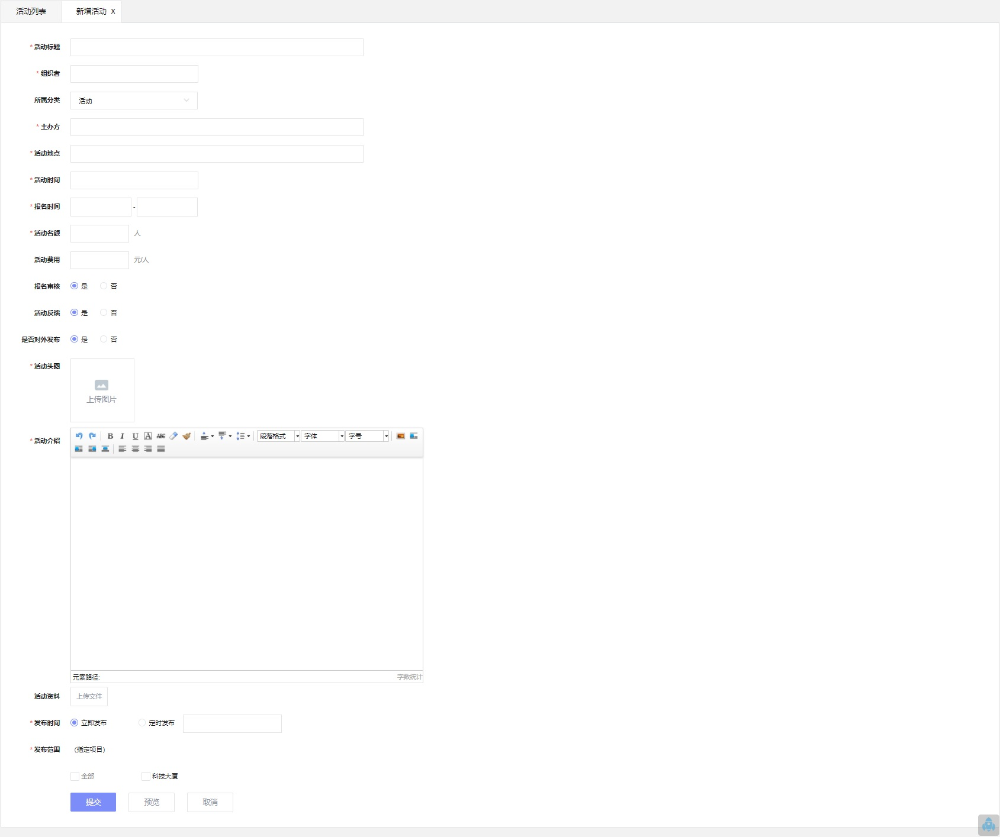

# 社群管理
!! note ""
    支持咨询发布、活动组织与推送
    
### **资讯管理**
***

可发布资讯类文章，可设置文章发布的时间和发布范围

***

### **活动管理**
***

可发布活动信息，可设置信息发布的时间和发布范围。
项目用户可以在小程序端报名。

***

### **分类管理**
***
可设置咨询和活动的分类

 

**文章类：** 在 **<u>资讯管理</u>** 里使用  
**活动类：** 在 **<u>活动管理</u>** 里使用

***

### **第三方服务**
***

提供第三方服务都可以在此设置，设置后小程序端能显示内容介绍及链接

***

### **合作管理**
***

希望和园区合作，提供第三方服务的用户，可以在小程序端提交申请。
申请的数据都汇总到 **<u>合作管理</u>** 里，园区运营负责人审核后

***

### **客户服务**
***

####服务设定
现阶段只支持 维修服务 的设置
可设置可以处理报修申请的客服人员和是否需要经过客服处理

####维修服务
客户从客户小程序端提交的报修申请的情况下，可查询到报修记录并做下一步处理
 
**备案：** 经客服判断不需要维修，点击 **`备案`** 按钮，可只备案并终结此单  
**派单：** 如果需要维修，点击  **`派单`** 按钮, 进入报修管理流程
客户端也可以记录客户口头的报修申请，并做  **`备案`** 或  **`派单`** 处理。

####投诉建议
客户小程序端提交的投诉、建议和咨询信息，也可以查询到，线下跟进处理。

***
