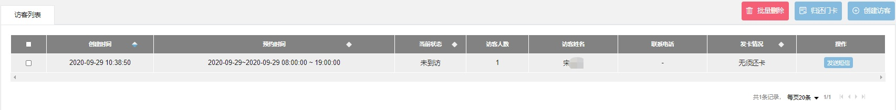
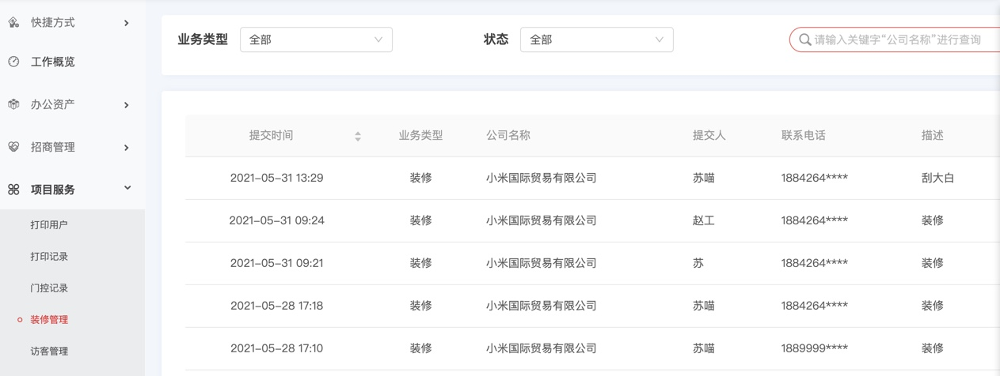
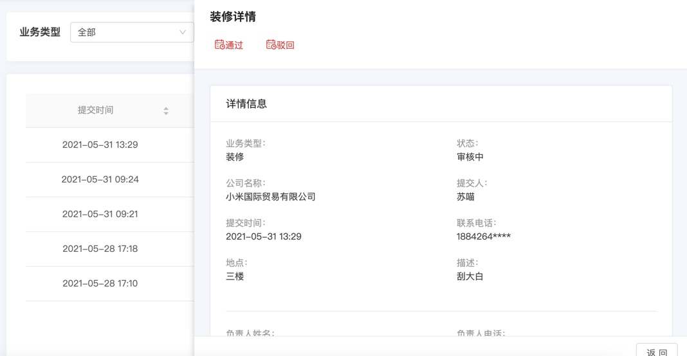
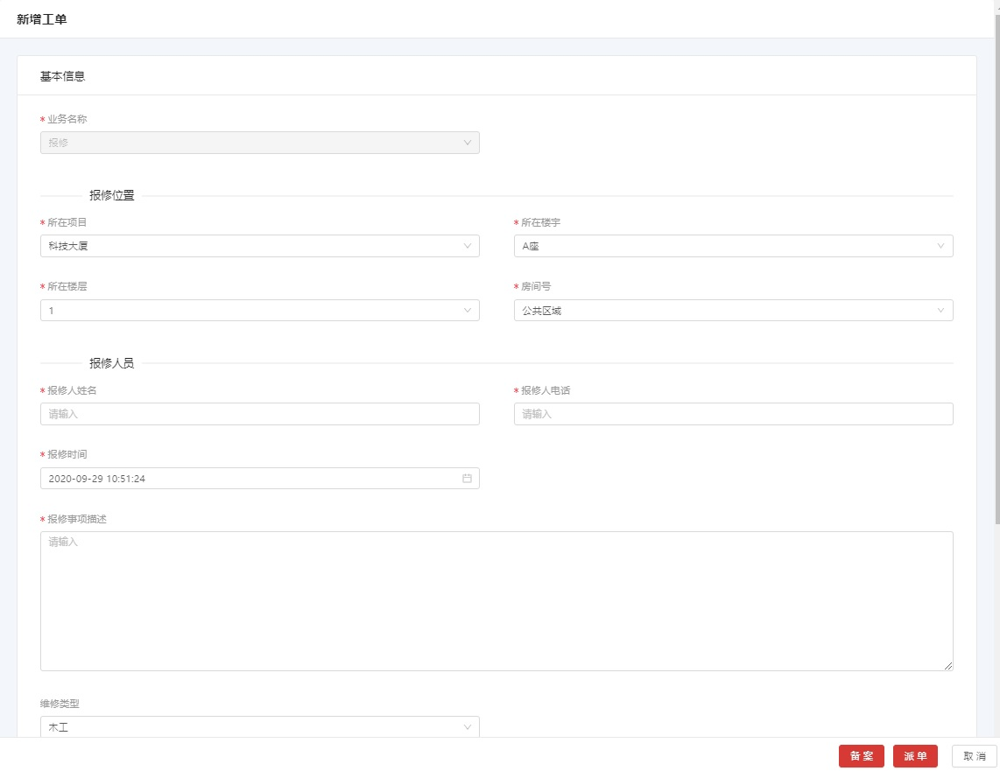

# 项目服务
!!! note ""
    项目可以给客户提供的服务

### **打印用户**

***
打印的用户会在列表中显示。也可以更新用户的免费额度。（在新作订单的时候可以设置给入驻企业的优惠额度，也可以在入驻维护里设置。）

***

### **打印记录**

***

可以查看和导出打印记录

***

### **门控记录**

***

可以查看和导出门控记录

***

### **访客管理**

***
####创建访客
创建访客，选取想赋予的门禁权限组

####编辑访客/取消预约

在访客访问之前，可以重新编辑访客的信息或取消预约

####门卡开门
如果需通过门卡通行，可以在 **<u>访客列表</u>** 页面，点击 该条访客记录，
进入到 **<u>访客列表</u>** 页面，点击 **`添加门卡`** 按钮，将发放的门卡卡号
记录。归还时点击 **`归还门卡`** 按钮，将回收的门卡卡号记录

####二维码开门
如果需要通过二维码开门，可以在 **<u>访客列表</u>** 页面，点击 该条访客记录，
进入到 **<u>访客列表</u>** 页面，点击 **`二维码打印`** 按钮，打印二维码后交给客户。二维码在设定的访问期间内有效。 

也可以在 **<u>访客列表</u>** 页面，点击该条记录的 **`发送短信`** 按钮，将二维码发送给访客的手机。

***

### **装修管理**

***
可以管理客户在会员小程序端提交的装修申请

 
点击装修申请记录，可以查看详细信息， **`驳回`** 或  **`通过`** 该申请

***

### **报修管理**

***

客户服务派单过来的工单或者报修管理里添加的订单都可以管理

 
**备案：** 经负责人判断不需要维修，点击 **`备案`** 按钮，可只备案并终结此单  
**派单：** 如果需要维修，点击  **`派单`** 按钮, 进入报修管理流程
 
也可以通过 **`新增工单`** 功能，记录客户口头的报修申请，并做  **`备案`** 或  **`派单`** 处理。

 
点击工单记录，可以更新接单/完工/返修等工单的状态，完工需要填写维修的内容及费用的，
费用会记到财务主题里

 
**<u>维修设定</u>**里可设置

- 维修信息
  可承担的维修类型种类及维修人员
- 提醒设定
  通过手机短信还是小程序发提醒给维修人员  
  在逾期设定的时候，可以设定提前提醒的时间和逾期后重新分配的间隔时间
- 流程设定  
  新增工单后是否需经由负责人分配  
  客户对于维修服务的评分是否对维修人员可视
- 财务设定
  收取费用的财务主体  

***

### **场馆预定**
***

本功能面向的是不需签合同的会议室预定。预定所需费用会反应到预约者所在的入驻企业。
在 **<u>访客列表</u>** 页面，点击  **`预约占用`** 按钮，打开  **<u>预约占用</u>** 页面。点击 点击  **`预约占用`** 按钮，在 **<u>新增占用</u>** 页面，预定会议时间，设定费用的财务主体

***