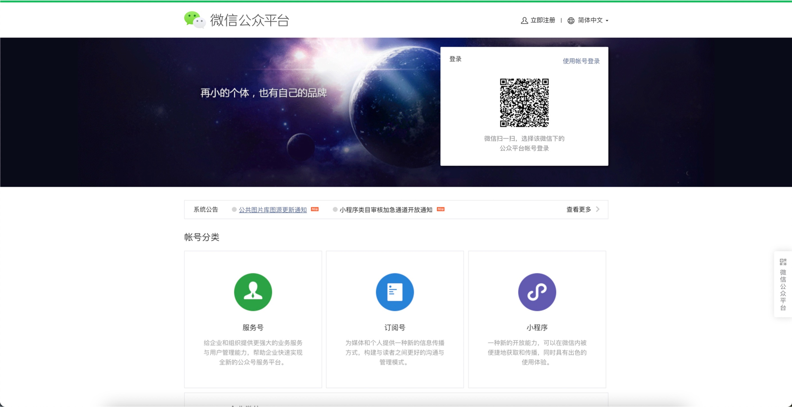
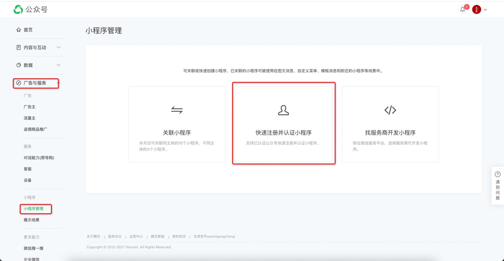
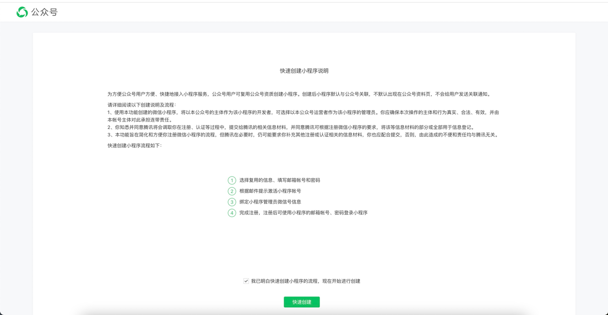
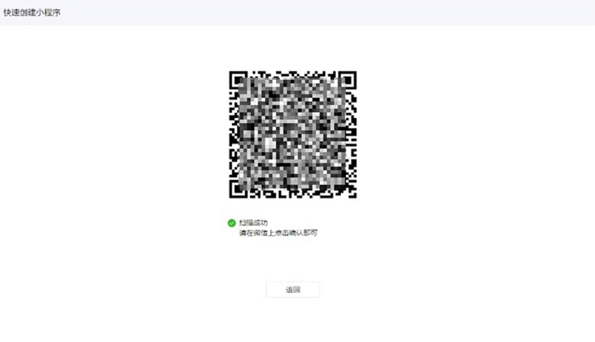
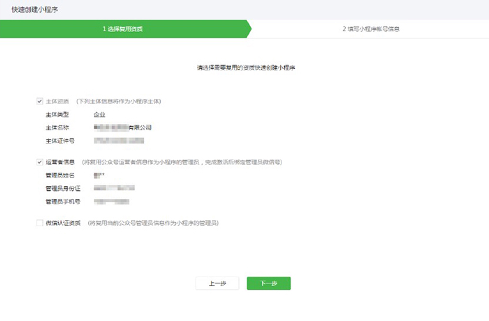
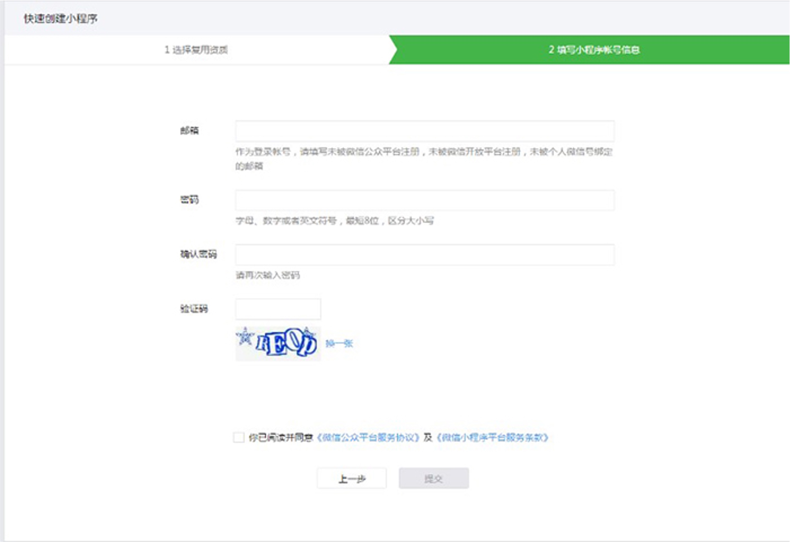
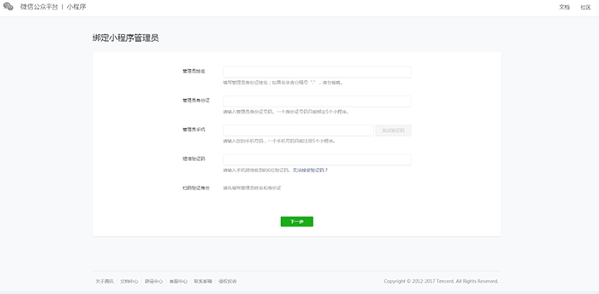

# 从公众号申请小程序
!!! note ""
    从公众号申请小程序，不用再走小额打款验证主体。生成的帐号具有独立的邮箱帐号、密码，跟走正常注册流程注册的小程序具有一样的能力权限

***

- 登录公众号
  https://mp.weixin.qq.com/
  
  
     

- 广告与服务->小程序管理->添加->快速注册并认证小程序
  
     
  
- 同意协议
 
     
  
- 管理员扫码验证
 
     

- 勾选需要选快速创建小程序的资质
    
  复用微信认证资质不需要再次支付认证审核服务费，也不需要审核
 
     
  
- 填写小程序帐号信息
     
  需要一个未绑定个人微信或其他公众平台的邮箱。
 
     
  
- 邮件激活小程序帐号，激活完成后即可使用邮箱帐号密码登录小程序
 
     
  
- 绑定小程序管理员
      
   绑定管理员，如果有在第四步有勾选复用运营者信息。最终以绑定管理员信息为准。
 
     
    
***
