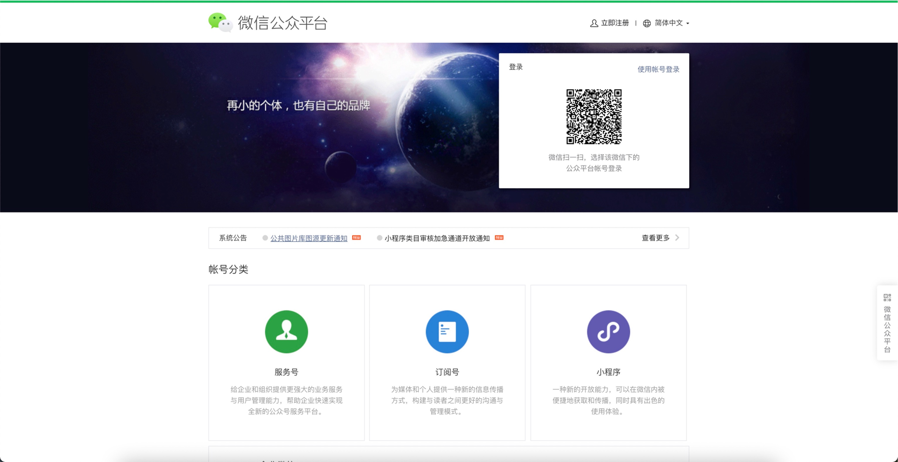
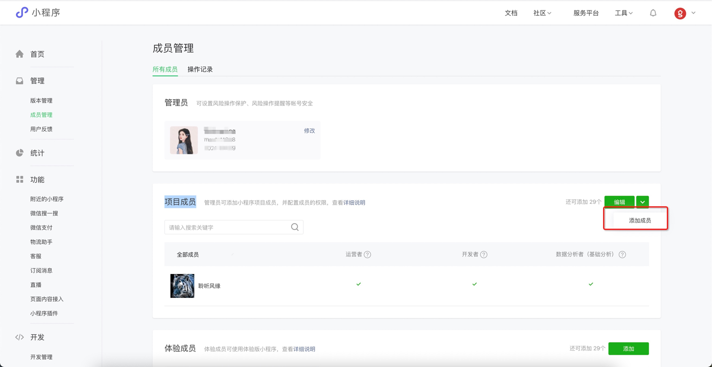
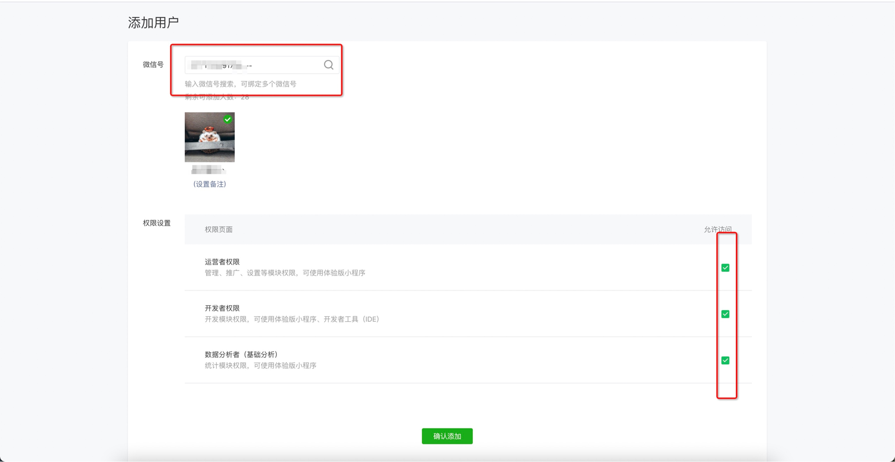
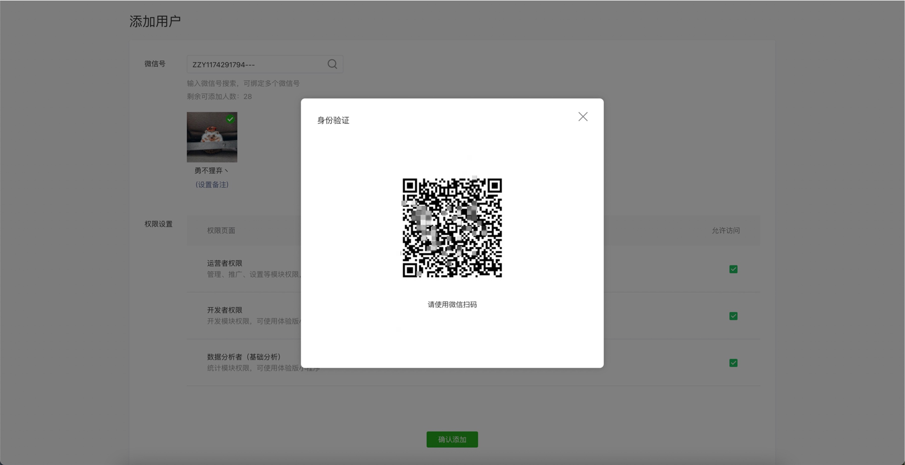
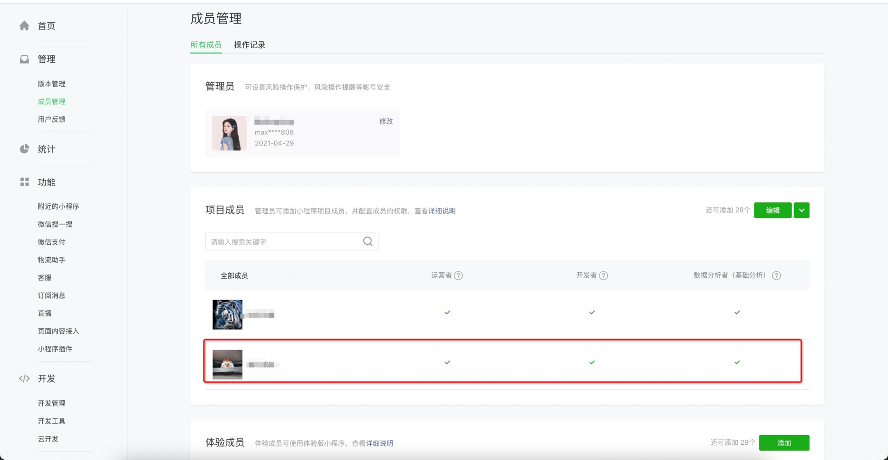

# 添加开发者账号
!!! note ""
    开发者账号

***

- 登陆小程序
  https://mp.weixin.qq.com/
  
  
     

- 管理->成员管理->所有成员->项目成员 点击【添加成员】】
  
     
  
- 输入微信账户ID，在点击【放大镜】，再进行权限设置
     
 
     

- 扫码认证身份，必须是小程序的管理员身份
     
 
 
       
    
***
