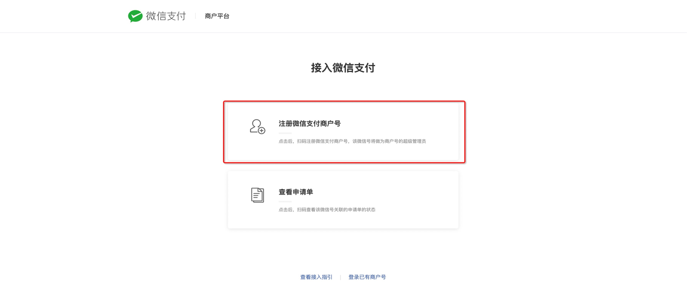
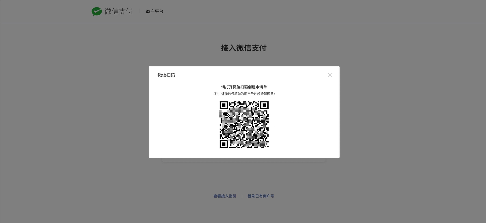
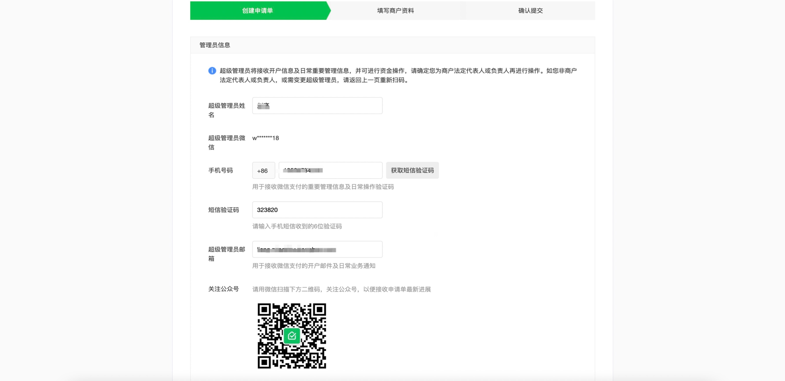
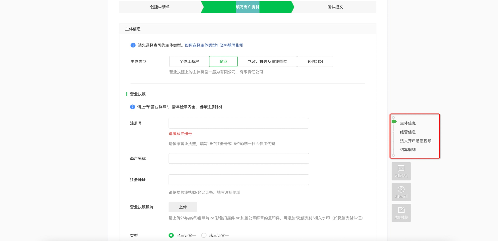

# 微信商户平台申请
!!! note ""
    商户平台

***

- 进入商户平台的login画面，点击【接入微信支付】，申请微信商户
  https://pay.weixin.qq.com/index.php/core/home/login
  
  
     

- 注册微信支付商户号
  
     
  
- 微信商户管理员打开微信的扫一扫，进行扫码认证
     
 
     

- 创建申请单
     
 
       

- 填写商户资料，认真填写主体信息、经营信息、法人开户意愿视频、结算规则。然后确认提交，等待审核
     
 
       
    
***
