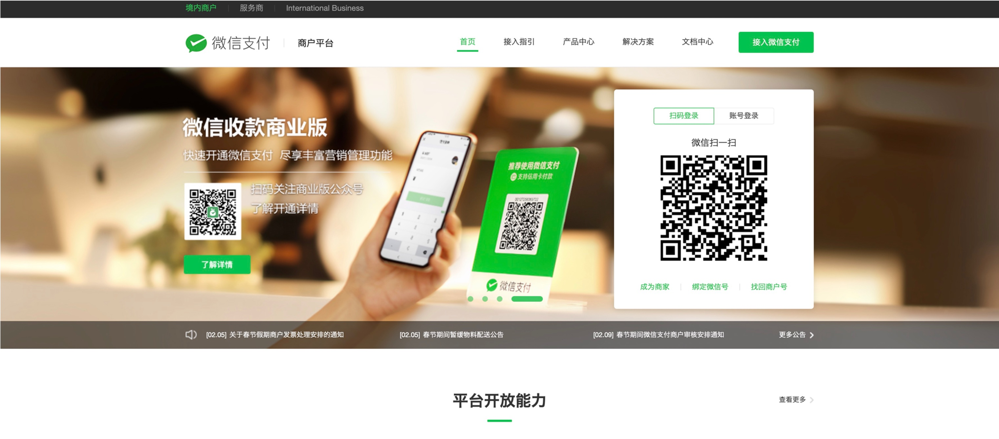
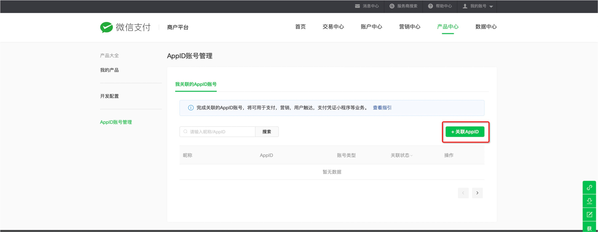
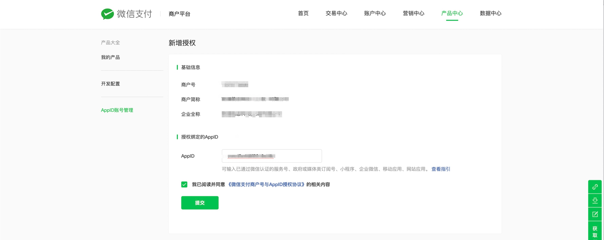
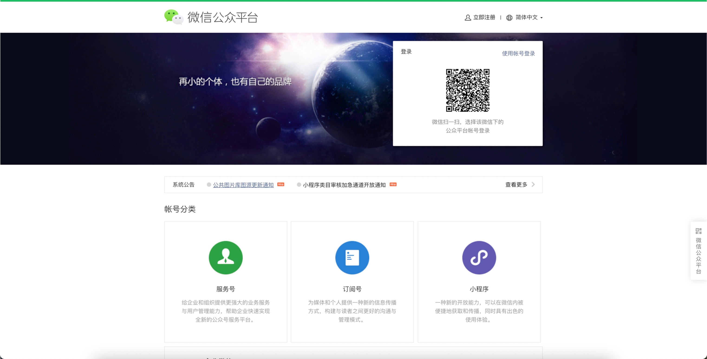
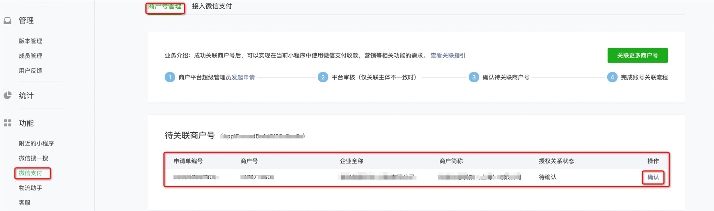
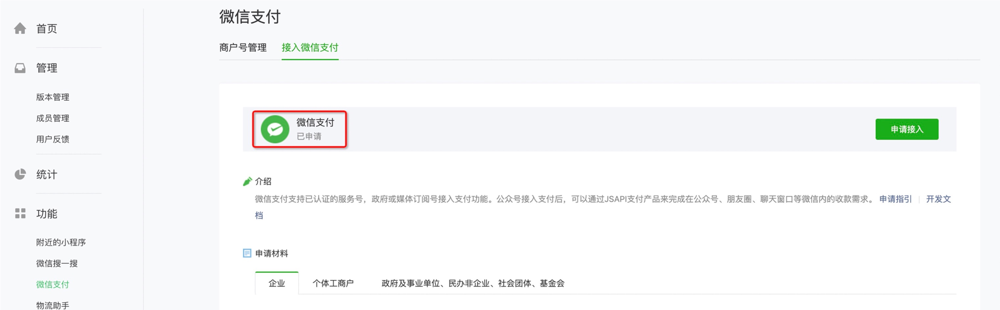
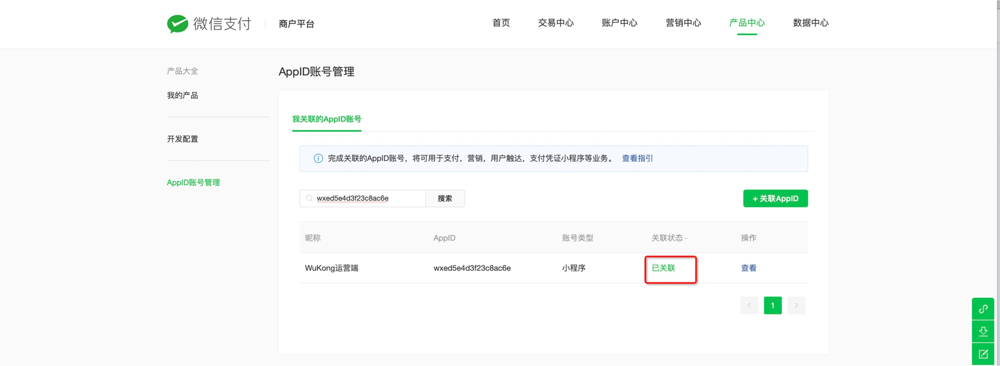

# 微信商户和小程序绑定
!!! note ""
    微信商户和小程序绑定

***

- 扫码登录微信商户
  https://pay.weixin.qq.com/index.php/core/home/login
  
  
     

- 产品中心->APPID账户管理->+关联APPID
  
     
  
- 输入授权绑定的小程序的APPID
     
 
     

- 提交以后，关联的状态是【待授权】的状态
     
 
       

- 登陆授权绑定的小程序
  https://mp.weixin.qq.com/
     
 
       

- 微信支付->商户号管理，点击【确认】
     
 
       

- 微信支付->点击【授权】
     
 
       

- 已申请
     
 
       

- 返回商户平台，关联状态已经变成【已关联】
     
 
     
***
