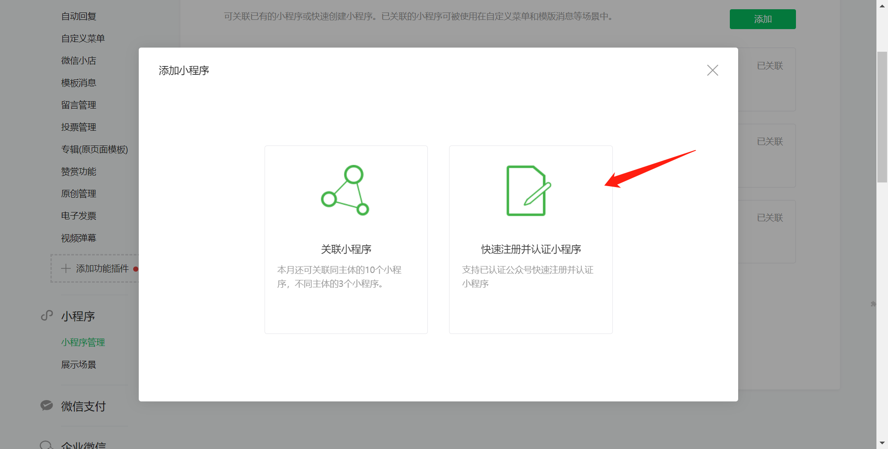
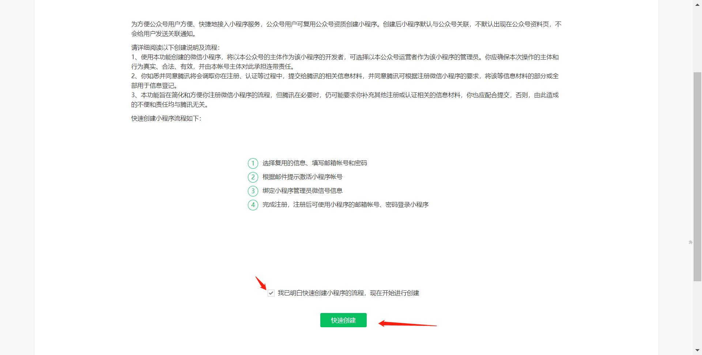
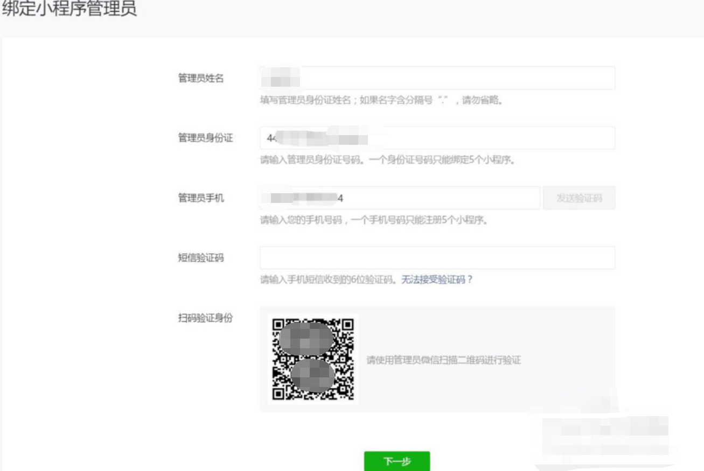
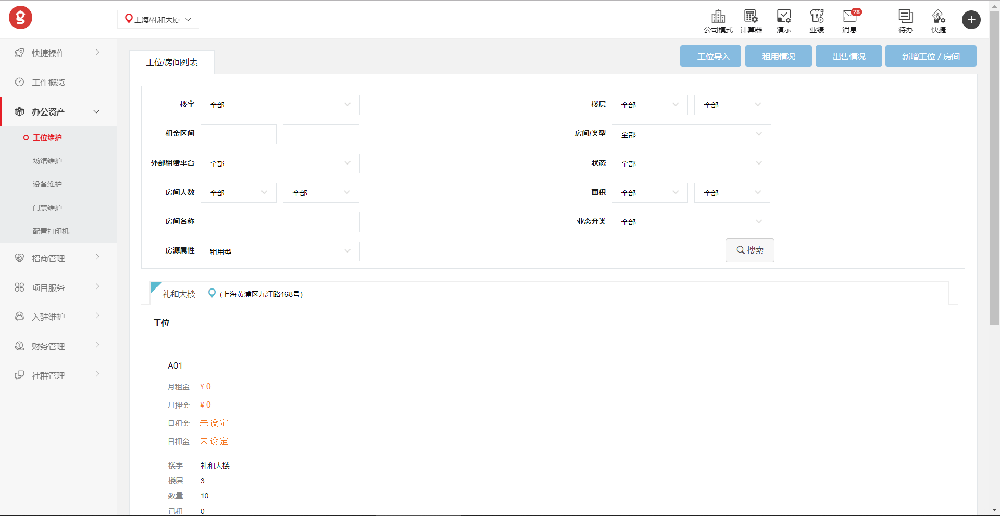
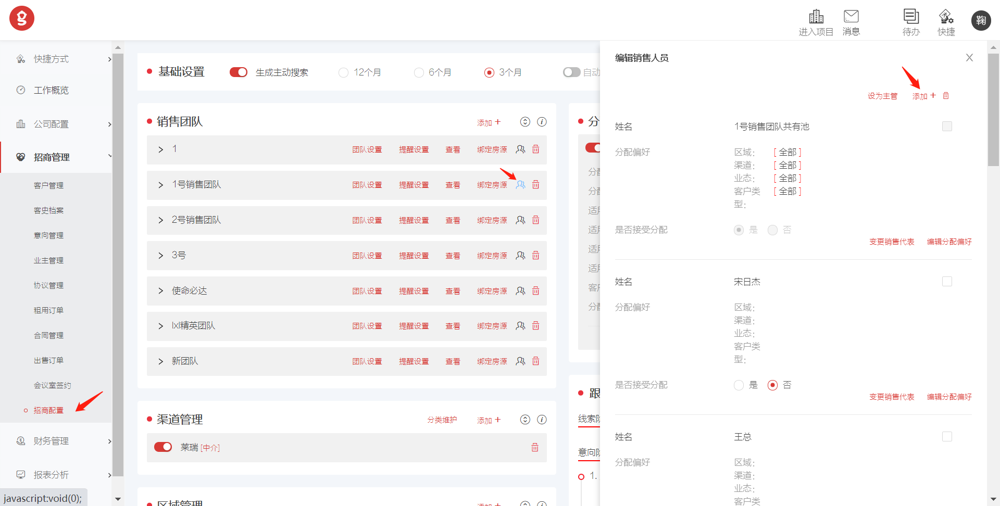
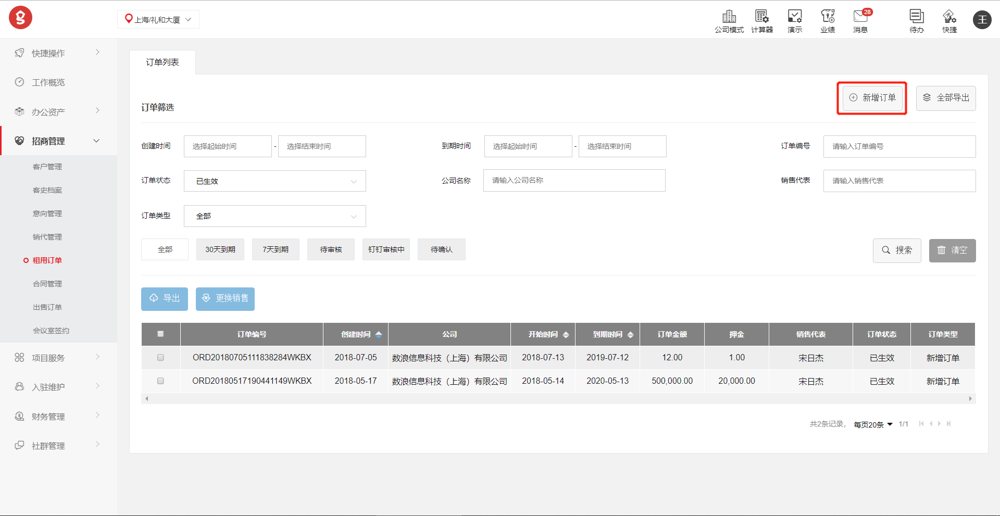
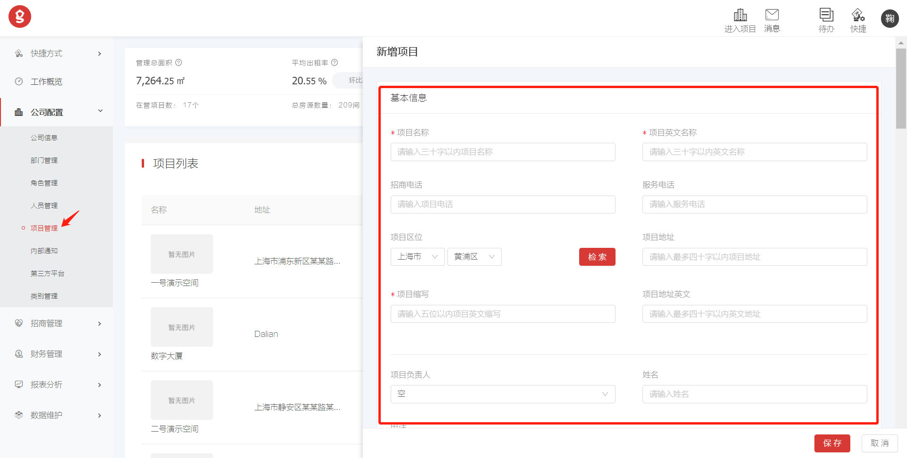
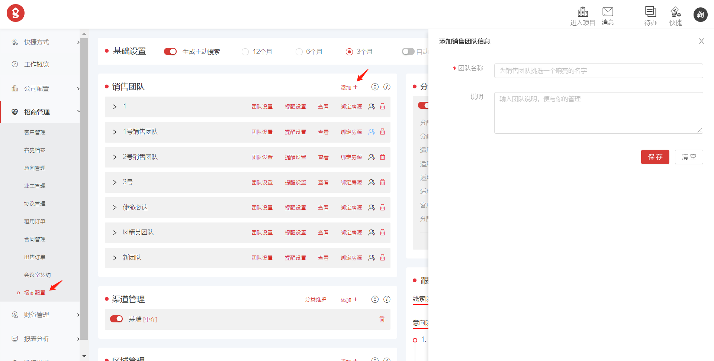
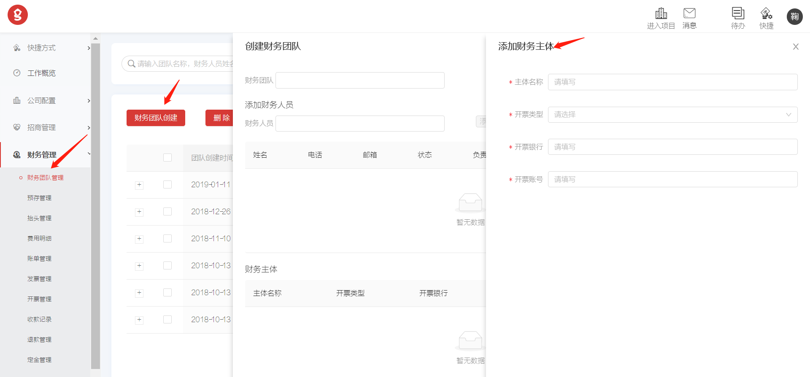

# 开启宝盒

!!! note ""
    欢迎来到悟空宝盒，通过对悟空宝盒的一些基础功能的介绍，能让我们快速掌握和使用悟空宝盒

## **一、前期准备工作**

### **1.管理系统基础信息提供**

`说明：`创建后台管理环境前您需要提供以下信息

 **公司信息**： XX有限公司，例如    **数浪信息科技（上海）有限公司** 【同时附上公司营业执照PDF文件】

 **URL**：管理系统登录地址，例如**demo**.wukongbox.os/oms

 **管理员基础信息**：包括 **姓名、手机号、邮箱**

------
### **2.悟空宝盒小程序**

`说明：` 我们为所有客户提供标准版W-HUB小程序，但如果您需要自己关联主体则需要自行申请注册小程序，并将相关信息提供给我们【小程序中涵盖打印门禁会议室预约与活动报名等功能，涉及到线上支付操作，所以需要开通腾讯支付通道，否则部分功能无法实现。】

**公众平台注册[小程序](https://mp.weixin.qq.com)**

`说明：`没有订阅号和服务号：在公众平台注册，账号分类选择小程序

 已有订阅号或服务号：微信公众平台小程序注册步骤如下：

第一步

登录微信公众号点击小程序管理

第二步

选择快速注册并认证小程序

第三步

勾选确认“我已明白...“点击快速创建

第四步

使用管理员微信扫描二维码确认

第五步

建议复用服务号认证资质勾选后下一步

第六步

填写一个新的邮箱作为小程序登录账户，该邮箱必须没有在公众平台注册过，填写相关信息点击提交

第七步

点击前往邮箱进行邮箱链接确认

第八步

进入小程序后台绑定小程序管理员信息，管理员用本人微信扫码确认

第九步

返回微信公众平台，登录刚才注册使用的邮箱账号，点击登录，管理员验证，在设置中补充小程序基本信息

**开发者账号设置**

登陆步骤：注册成功的小程序账号->用户身份->成员管理（添加成员）登陆，开发管理>开发设置>小程序插件

**支付环境申请**

需提供申请认证的相关资料

登陆步骤：登录注册成功的小程序账号->微信支付->开通

**填写详细资料**

完成上述步骤后将以下信息提供给悟空宝盒小程序登陆用账号和密码

品牌logo：png格式，用于小程序主页显示

品牌介绍：用于小程序主页显示

 支付商户号：登陆[**商户平台**](https://pay.weixin.qq.com)->账户中心->商户信息->微信支付商户号

支付商户API密钥：登陆商户平台->账户中心->API安全->设置API密钥

------

### **3.云打印准备工作**

**建议使用云服务器，若您想要本地部署节点服务器我们给您如下使用节点服务器情况时的软硬件及环境参数参考**

`说明：`配置云打印之前需要您提供一台**节点服务器**（建议该服务器仅作为打印机专用服务器，不做他用）

**硬件参考**

>  内存通道的X86架构的服务器，或更高配置

>     CPU：Intel XeonE3/ E5系列、2.5G主频以上、4核CPU，或更高配置CPU

>     内存：最少8内存或更高配置内存 

>     硬盘: SAS 15K rpm, 500G，或更高配置硬盘

**软件参考**

>     推荐Windows Server 2012 R2或更高版本
> 必须是64位操作系统
> 一个内网固定IP
> 
>
>  稳定可用的OFFICE软件，包含Word、Excel、PowerPoint等 
**网络环境参考**

>   100M以上以太网，可以访问外网和打印机

**其他外设**   

> 显示器、键盘、鼠标、网线
------
## **二、关于系统**

### 1.名词解释

**公司模式与项目模式**

系统中规定的两种模式，适用于多种情况，如集团管理与项目管理、总公司与分公司管理等，根据不同身份权限可以在公司和项目模式下进行不同操作。

**角色**

系统中队人员权限集合的定义，可理解为系统功能权限的集合 

**类别管理**

可理解为标签管理，此处可进行标签的新建与删除。

**预售订单、租用订单与出售订单**

预售订单可以理解为在正式成交前建立的订单，创建预售订单可以锁定房间，在签约后可转变成正式租用订单，租用订单简单来说可以理解为以租赁形式将房源租给入驻客户，您可以按照合同定期向入住客户收取租金；出售订单可以理解为您将房源一次性售出，并按照合同一次或分期收取费用的形式。

**销代**

销售代表，招商团队的组成成员。

**费用与账单**

在管理系统中，费用与账单进行分开管理，费用可以是组成账单的子集，一个账单里可以有多笔费用，费用分为自动生成的（租金、押金）和手动添加的。

**社区管理**

系统中管理项目空间内活动与资讯的地方的定义，并且可以在空间社群中添加内部服务信息。

### **2.基本操作**

>每个业务模块，基本上分为<b>列表、</b> <b>详情、</b> <b>新增、</b> <b>编辑</b> 四个功能页面

>点击  **`新增`**  按钮，打开<b>新增</b>  页面，可以新增加记录

>点击列表中的某一条记录，打开  <b>详情</b> 页面，可以查看记录的详细信息

>点击  **`编辑`**  按钮，打开<b>编辑</b> 页面，可以修改该条记录的信息
>
>

------
### <b>3.功能概要</b>

#### <b>3.1资产信息维护</b>

> 
> 工位维护：设置工位、房间的基础信息，只有还没被租用的工位、房间才可以在<b>招商管理</b>里出租

> 场馆维护： 设置场馆信息，比如说会议室等设施的基础信息，在<b>空间服务</b>里预定租用

> 设备维护： 设置设备信息，比如说投影仪等设备的基础信息，在<b>空间服务</b>里预定租用

> 门禁维护：设置门禁信息，包括蓝牙、二维码、SN号等信息，在<b>小程序</b>中可以进行门禁的开门操作

> 打印机维护：设置打印机信息，包括团队每月优惠与设备基础配置信息，在<b>小程序</b>或者<b>电脑驱动打印</b>可以进行打印操作

------

#### 3.2怎样增加一个新的空间（项目）

如果您想增加新的空间（项目），可以在<b>`公司模式`</b>下点击菜单按钮 **`公司配置`** ,然后点击 **`项目管理`** 窗口，打开<b>空间列表</b>页面，点击页面右侧的 **`新增项目`** 按钮，编辑空间（项目）的信息  

- **基本信息** 
  
  空间名称等基本信息，按照提示输入即可
  

- **介绍信息**

可上传图片，也可记录空间的详细文字介绍，此处图片也会在小程序上同时展示

- **预设规则**
可以设置账期和出账方式，出账方式有四种

    >**1.按固定日期出账** ：按照设置的固定的日期出账单 
  
    >**2.按合同日期出账** ：按照合同的日期，根据设置的提前多少天出账单 
  
  >**3.按照合同开始日期为单月出账账(支付周期为2个月)** ： 合同的开始日期如果不是单月的1日，从合同的开始日期开始到第一个双月的月末日期结束为一个账单，以后从单月的1日开始以2个月为周期分割账单
  
  >**4.按照季度出账**：从合同账单开始的日期，到第一个季度月末结束日期为一个账单，以后从单月的1日开始以3个月为周期分割账单
  > 
  

!!! info "有几个概念"

    >**账单开始日**：账单开始的日期 
    
    >**账单生成日**：账单生成的日期即账单的计入日期 
    
    >**缴费截止日**：缴费的截止日期，如果超过截止日期，可能会收取违约金 
    
    >**按整月天数**：超过（包含）此天数即算为整月

!!! tip "注意"

    >如果 **勾选** 支持多种出账方式，在新增订单的时候可以选择出账方式
    
    >如果 **不勾选**，只可以选择默认的出账方式

- **工位设置**

按照提示输入即可，按月支付和按天支付至少需要输入一项。需要注意的事，只有这里设置了按月支付，在新增房间的时候才可以设置月租的租用方式。同理，只有设置了按天支付，在新增房间的时候才可以设置日租的租用方式。详见<b>新增工位/房间</b> 
结算期限：退租，完租后多少天之后才可以进行订单结算。

- **房间设置**

    同<b>工位设置</b>

- **结算方式**

设置以公司为单位结算还是以空间为单位结算

- **违约金规则**

逾期（超过缴费截止日未缴费）的账单将按账单金额的百分比计算每天的违约金额

- **楼宇配置**

设置空间所在（所有）的楼宇名称及位置信息

***

#### **3.3重新编辑空间**

在<b>空间列表</b>页面，点击需要修改的空间，打开<b>页面详情</b>页面，然后点击 **`编辑`** 按钮，打开<b>编辑空间</b>页面。编辑内容详见<b>新增空间(项目)</b>

***

#### **3.4设置审批流程**

**审批流设置**

`说明`：审批权限设置为——设置具有相关权限职能的多级审批角色，即<b>具有该角色的员工</b>为审批人 

* **订单新增/修改**： 新提交的订单，以及订单生效后进行修改之后所使用的审批流。主要审核客户的资质，房间，价格，付款计划，合同，以及优惠等信息 
* **订单退租**： 发起退租申请的时候使用的审批。主要审核要返还的押金等事项
* **订单结算**： 客户最后清算时使用的审批。主要审核已发生的费用，和实际退的金额 
* **合同内容**： 原则上，由合同模板直接生成的合同为有效合同。当合同内容进行修改的时候， 使用的审批流。 主要审核合同的文本内容
* **合同原件**： 审核合同最后的签署件使用的审批流。主要审核合同内容，以及印章等
* **新增费用**： 手工录入费用的时候使用的审批流。主要审核费用金额，公司或房间名称 
* **新建账单**： 手工创建账单的时候使用的审批流。主要审核账单包含的费用，付款周期等
* **账单复核**： 手工创建账单提交复核申请的时候进行的操作。主要审核需要复核的账单
* **定金申请（暂未开启）**： 客户交付定金使用的审批流。主要审核要锁定的房间，定金金额，拟合同金额等

**支持的审批类型**

* **无审批**： 不设置审批，流程中会自动进入下一步
* **悟空宝盒**： 审批消息和动作确认在悟空宝盒系统内完成
* **阿里钉钉**： 审批消息和动作确认会发送到阿里钉钉中完成。（只有在“第三方平台”中配置了“阿里钉钉“之后，才有此选项）

***

#### **3.5为空间增加工位/房间** 

可以点击菜单按钮 **`办公资产`** ,然后点击 **`工位维护`** ，打开<b>工位/房间列表</b>页面，然后点击 **`新增工位/房间`** 按钮，打开<b>新增工位/房间</b>页面

- **基本信息**
 
<b>工位/房间</b>的基本信息，租用方式日租/月租是否可选，取决<b>空间管理</b>的<b>工位/房间</b>设置

- **业态分类**

选择主营业态的分类

- **添加属性**

添加工位/房间的有特色的属性，点击 **`+`** 可添加多条

- **关联门禁**

在<b>门禁维护</b>设置好门禁类型后，可在此处配置当前<b>工位/房间</b>所具有的门禁权限

- **展示信息**
 
可上传工位/房间的照片

***

#### **3.6设置既有的工位/房间**

**编辑**

在**工位/房间列表**页面，点击需要修改的工位/房间，打开**工位/房间详情**页面，然后点击 **`编辑`** 按钮，打开**编辑工位/房间**页面。编辑内容详见**新增工位/房间**

**锁定**

在**工位/房间详情**页面，点击 **`锁定`** 按钮，在打开的页面中输入需要锁定的工位数量，然后点击 **`确定`** 按钮，被锁定的房间不能进行新增订单操作。

**解锁**

点击 **`解锁`** 按钮，在打开的页面中输入需要解锁的工位数量，然后点击 **`确定`** 按钮

**租用情况**

点击**`租用情况`** 按钮可方便查询空间（项目）上目前的房屋租用情况，系统会根据不同颜色区分房间状态

***
#### 3.7招商团队与财务团队配置

**如何配置招商团队**

在**`公司模式`**下点击**`招商管理`**选择招商团队配置，添加一个新的招商团队，并将对应人员添加进入新创建好的团队中。

**如何配置财务团队**

同样，在**`公司模式`**下选择**`财务管理`**，添加新的财务团队，并将财务人员添加至新创建好的团队中，同时需要配置财务主体。

#### **3.8如何新增加订单**

**销代管理里维护销售人员**

点击菜单按钮 **`招商管理`**,然后点击 **`销代管理`** ，可以将公司员工增加到销售人员团队中。

**客户管理**

点击菜单按钮 **`招商管理`**,然后点击 **`销代管理`** ，可以将公司员工增加到销售人员团队中。

**合同模板**

新增订单之前我们需要先创建一份合同模板，将需要填写的信息留出来用替换字符替换，或者创建自定义字符替换。操作步骤为，点击菜单按钮 **`招商管理`**,然后点击 **`合同管理`** ，再点击<b>`合同模板`</b> 创建合同模板。

**新增订单**

完成上述操作后，我们可以点击 **`招商管理`**  ，再点击 **`新增租用订单`**.

**租期费用**

- **筛选**

点击菜单按钮 **`招商管理`** ,然后点击 **`订单管理`** ，打开**订单列表**页面，设置筛选条件，点击 **`搜索`** 按钮，满足条件的可租用的工位/房间会显示在**工位**和**房间** 区域

- **工位·房间**

选取想要租用的工位或者房间，点击名称后的购物车图标，选取的工位/房间会放到页面下方的购物车中

- **购物车**

输入支付周期，如果有优惠，可以输入免费的开始日期和结束日期，选择出账方式，如果是工位的话，需要输入工位的数量（团队成员人数不能超过工位的数量。详见 **团队管理**），点击 **`下一步`**

**客户信息**

选择销售人员，销售渠道，输入客户信息（如果是既有的客户，可通过关键字搜索），点击 **`下一步`**

**费用调整**

- **租用明细**

再次确认下显示的租用信息是否正确

- **费用调整**

可以修改费用金额，计入日期，也可以按照比率修改金额

- **其他费用**

详见 **费用管理**

**合同优惠**

在设定好之后，可以在预约会议室和打印的时候，设置每月优惠额度。

**信息确认**

再次确认下显示的信息是否正确如果有问题，点击 **`上一步`** 返回修改，没问题，点击 **`提交`** ，此时订单为 **“待签约”**状态，如果 **订单列表**页面，没有这条订单，特别注意 **订单筛选**里的订单状态是否选择正确。 **“待签约”** 状态的订单需要在 **合同管理**中签约

点击菜单按钮 **`招商管理`** ,然后点击 **`合同管理`** ，打开 **合同列表** 页面，设置筛选条件，点击 **`搜索`** 按钮。点解需要签约的合同编号，打开 **合同详情**
页面，点击 **`上传原件`** 按钮，上传合同原件，点击 **`提交`** 后，订单状态变为 **“待确认”**

打开 **订单列表**页面，搜索  **“待确认”** 的订单，没有这条订单，特别注意 **订单筛选** 里的订单状态是否选择正确。点击该条订单记录，打开 **订单详情**页面，点击 **`确认订单`** 按钮，订单创建成功后订单状态变为  **“已生效”** 。产生的费用和账单可在  **财务管理** 查看，详见  **费用管理** 和  **账单管理**

***

#### **3.9门禁怎样维护**

**门禁配置**

在 **门禁配置**页面，填写下面的内容 【`说明：`如需使用门禁设备请联系技术支持进行配置】

* **门禁类型**：可以添加，编辑。用于门禁分组。举个例子，可以根据楼层来划分类型，或者根据功能（梯控，闸机）划分。  
* **门禁别名**：系统显示门禁名，通常和房间号对应。
* **楼宇**：选择要配置哪个楼宇的门禁，选取后在依赖门禁列表中会显示当前楼宇的门禁。
* **SN编号**：门禁设备的识别号
* **IP和端口**：按照提示填写即可
* **蓝牙名称**：选择蓝牙开门的时候填写，蓝牙设备的pid_lockid_areaid_gateid
* **蓝牙地址**：蓝牙设备的mac地址
* **轮播图片**：pad门禁控制设备显示的轮播图片。
* **开门方式**：选择需要的开门方式
* **依赖门禁配置**：配置现在的门禁，同时会拥有依赖门禁的权限。以大门和开发室为例，想去开发室必须经过大门，所以通常设置开发室门的时候将大门作为依赖门襟。这样为用户赋予门襟权限的时候，只选开发室即可同时拥有开发室和大门权限。

**权限组维护**

权限组可用于在  **空间管理** 的  **访客管理** 里，创建访客时给访客赋予门禁权限。在  **权限组维护**页面，填写下面的内容

* **权限组名称**：可以添加，编辑。
* **空间门禁**：选取权限组所具有的门禁权限。

***

#### **3.10维护入驻团队**

**团队维护**

在订单生成之后，输入的团队信息可以在  **团队维护** 里编辑。批量添加会员也在此处操作。

**会员管理**

在订单生成之后，团队负责人会自动登录成会员。团队的其他成员需要在  **会员管理** 里维护

***

#### 3.11社区管理

**资讯发布**

点击**`社群管理`**，选择资讯管理，添加一篇新的文章，将资讯的主要信息填写进入相对应位置，点击发布

**活动发布**

同样，点击**`社群管理`**，选择活动管理，添加一条新的资讯，将资讯的主要信息填写进入相对应位置，点击发布；注意，在资讯和活动的富文本编辑器中添加图片文件时，需要将文件保存在本地，通过编辑器中的添加按钮进行添加。

**第三方服务**

在**`社群管理`**中，点击**`第三方服务`**,添加新的服务，填写对应的信息。

## 三、场景模拟

### 1.运营场景

**1.1运营工作流程**

组织架构配置 >人员导入 >权限配置 >项目配置 >办公资产配置 >社区管理 

**1.2运营场景再现**

初次进入系统时，面对“空空如也”的系统，作为运营的你应该怎样将系统丰满起来呢？

首先你需要在`公司模式`下`公司配置`里点击`部门管理`将公司的组织架构创建进系统，在组织架构创建成功后，可以根据实际情况建立人员权限【系统会自动生成一部分默认权限组】如果你还想细致划分可以在`角色管理`中配置。

当你把部门和权限都配置好后就可以着手创建新的项目了，点击`项目管理`找到`新增项目`，这时你会看到页面右侧会出现填写项目信息的页面，根据提示将项目数据填写明确【2.3.2中有提到的注意事项需要注意】

项目创建好了之后你就可以将公司的员工导入进系统中了，系统支持批量导入【按照模板格式，系统会进行校验】这里有一点需要注意，就像之前功能介绍中提到的系统中的权限分为公司角色和项目角色，在添加人员的时候一定要把两个类型的权限都赋予上

接下来你可以进入项目模式【点击右上角的`进入项目`]进行办公资产和社区管理配置，找到`办公资产`点击`房源维护`系统支持批量导入房源，操作的细节可以参考功能概要2.3.5；在添加房源信息的时候需要注意月租金有两种设定方式，一种是你直接设置好固定金额，另外一种是你设置好每平方米单价，系统帮你算出月租金，如果你要想客户收取物业费并想通过系统来记录整理的话，不要忘了设置物业单价

在`办公资产`中还有一个按钮是`场馆维护`如果你的项目上有路演厅、会议室、露台等这些场馆并且想要将他们对内对外开放使用并管理起来的话，你可以在这里把它录入进系统中

经过上述操作，系统就丰满了起来，也为其他部门（招商、财务）建立起了基础操作必备的条件。

### 2.招商场景

**2.1招商工作流程**

配置招商团队 >建立客户池 >意向管理 >录入合同模板 >创建订单

**2.2招商场景再现**

在运营同事将上述基础信息搭建录入完成后，负责招商的你就可以进行系统中招商环节的输入了，首先需要你做的是配置招商团队，在`公司模式`下，点击`招商管理`，找到`招商配置`点击添加团队，讲团队信息录入系统

建立好团队后，点击团队右侧成员按钮，点击添加就可以将已经导入过的公司成员加入进创建好的销售团队里了，同时可以在这里设置团队主管

当你创建好招商团队之后就可以组织团队成员进行客户的录入了，客户录入支持批量单入，当然在这个环节客户信息录入的越详尽后期得到的汇总数据就越丰富，在招商管理中设置有`意向管理`，在这个模块中销售代表可以将客户线索详细地记录在系统中

当你跟进的客户最终决定成单签署合同时，就到了创建新订单的时候了，不过在这之前你需要确定是否已经将合同模板录入到了进系统中，那么如何添加合同模板呢？点击`招商管理`里面的`合同管理`点击`添加模板`将模板信息导入进富文本编辑器中保存就好了。有了合同模板再添加新的订单就好了【创建订单的操作细节可以参考2.3.8】

### 3.财务场景

**3.1招商工作流程**

配置财务团队 >调整费用、生成账单、确认收款、押金核销与退款

**3.2财务场景再现**

和招商配置一样，你需要先配置你的财务团队，不同的是你需要为每个团队配置“财务主体”，这个财务主体可以是相同的可以是不同的，简单理解就是设置对公账号

在系统中你需要明确费用和账单的关系，系统中租金和物业费【周期性费用】会自动生成，同一个客户的不同费用可以组合成一个账单，账单可以删除但是账单的费用还是会在费用管理中。在你设置好财务团队并理解了费用和账单的定义之后，你就可以在系统中进行调整费用、生成账单、确认收款、押金核销与退款等所有操作

## 四、常见问题Q&A

### WEB系统

**Q：**为什么我在登录不进去系统了？

**A：**web管理端在使用时需要保证良好的网络环境，在登录不上时可以查看当前网络状态是否通畅，或可以更换浏览器【建议使用Chrome浏览器】重新登陆；检查您输入的URL是否正确；检查您输入的账号密码是否正确。

**Q：**为什么有些按钮和功能我看不到？

**A：**尝试刷新浏览器，若仍然无法显示联系管理员，查看是否未配置相关权限。

**Q：**为什么我在创建订单的时候看不到房源信息？

**A：**可以先查看房源管理中是否已录入房源信息，该房源状态是否未可租状态；若房源配置没有问题，请确认在创建订单操作时是否操作错误，比如输入租期后未点击搜索按钮。

**Q：**我创建完订单为什么看不到钢材新增的订单？

**A：**生成订单后您需要在合同管理中提交合同原件，并在订单管理中找到待确认状态下的订单点击“确认生效”才可以看到“已生效”的合同

**Q：**有员工离职了我该怎么操作？

**A：**管理员在公司模式下，进入`人员管理`照到离职员工点击`员工离职`。

**Q：**客户租期已到为什么不能进行结算？

**A：**在系统中查看一下该租户的押金账单是否进行了确认收款操作，在确认收款后才可以进行退租预结算

### 小程序

**Q：**为什么我的小程序获取不到二维码？

**A：**检查一下小程序登录状态，可以退出微信关掉微信进程重新登陆。

**Q：**为什么我可以上传文件，但是不能打印？

**A：**联系管理员，查看打印额度是否已用完。

**Q：**我在小程序上预约了会议室，为什么不能开门？

**A：**首先查看下会议室订单状态是否预约成功，如果预约成功需要在预约时间之后才可以进入会议室，提前无法进入。

**Q：**为什么我“联系客服”打字了但是没有回应？

**A：**联系管理员是否在小程序公众平台开通了客服功能并且设置了客服人员微信。

**Q：**为什么我在线支付会议室（打印）小程序显示“参数未配置”？

**A：**联系管理员小程序公众平台是否已开通在线支付功能并且已关联商户号。

未完。。。

### 硬件

**Q：**为什么我扫码/刷卡之后无法开门？

**A：**联系管理员检查门禁控制器是否供电供网正常，在检查一下人员权限是否配置正确，可以联系宝盒技术支持进行排查。

**Q：**打开门后插锁一直在响无法成功关门怎么回事？

**A：**由于正常使用或者型材偏移导致插锁无法正好落入孔洞中，可以联系管理员或者宝盒硬件支持进行调整。

**Q：**为什么我的手机蓝牙开门失败了？

**A：**蓝牙开门失败可以检查一下以下几个地方：

  	·手机蓝牙是否打开

​	  ·手机定位是否打开

​	  ·手机的微信获取定位权限是否打开

  	确认好以上几点关掉微信进程重新登陆尝试重新开门。

**Q：**为什么我传好了文件但是打印机不出纸？

**A：**检查打印机的供电供网状态，确认无误后检查是否有卡纸或者耗材耗尽，可以联系宝盒技术支持远程排查。
未完。。。

